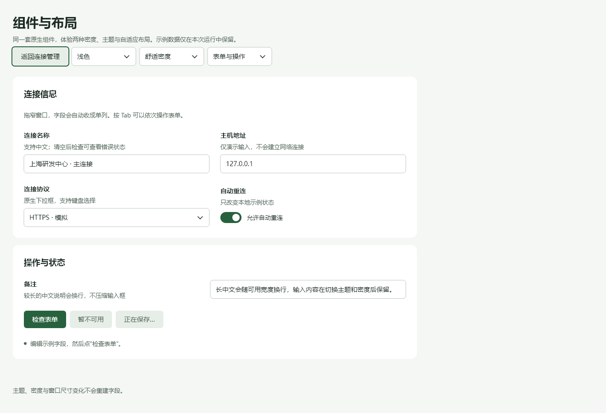
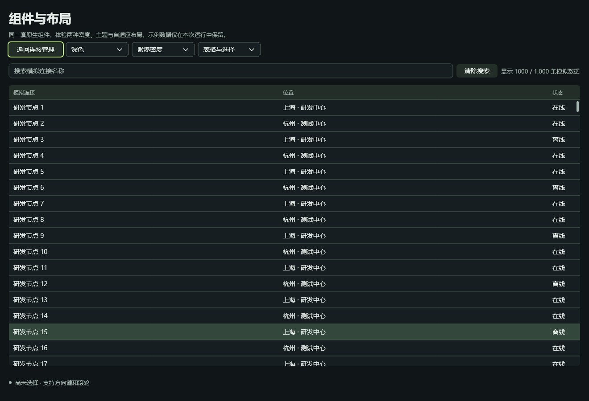
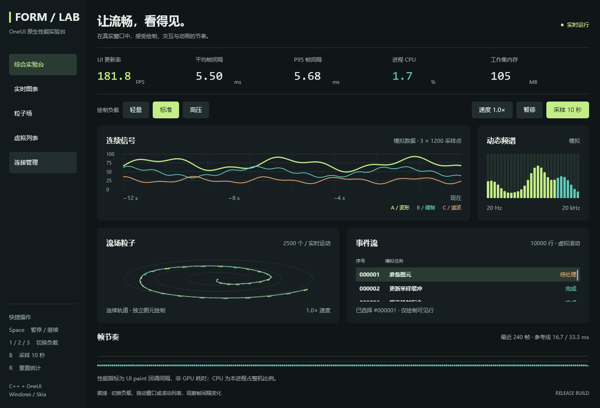

# OneUI

[English](README_EN.md) | 简体中文 · [MIT](LICENSE) · C++17 · 0.1 开发版

**用 C++ 写原生桌面界面，布局、主题和数据绑定交给 OneUI。**

你可以直接组合 C++ 控件，也可以用 `.one` 标签描述页面。两种写法共用 C++ 业务逻辑，最终都是保留在内存中的原生控件树：改状态就更新对应属性，不会每帧重新创建页面。底层使用 Skia 绘制，不需要 JavaScript 或 WebView。

适合设置工具、连接管理器、运维控制台，以及包含大量表格、图表和表单的桌面应用。当前新增开发入口以 **Windows + C++17** 验收；API 仍在演进，不是稳定版承诺。

## 实际运行效果

浅色表单：默认间距、字号、绿色强调色和自动分栏，应用代码不用计算字段坐标。



深色紧凑表格：1,000 条模拟记录，原生虚拟化绘制。



综合实验台：图表、粒子、滚动列表与实时指标。



以上是仓库示例实际生成的原生客户端截图。更多[窄窗口与错误状态截图](docs/40-declarative-stage-validation.md#截图)，以及[可复现的截图脚本](examples/performance_lab/capture-gallery.ps1)。

## 运行 Demo（Windows）

需要 Git、Python 3、PowerShell，以及 Visual Studio / Build Tools 的“使用 C++ 的桌面开发”（包含 Windows SDK、CMake、Ninja）。示例要求 CMake 3.20+。**首次下载和编译 Skia 最耗时；以后修改页面只需增量构建。** 不必安装 Node.js。

**1. 获取源码。**

```powershell
git clone https://github.com/too1soft/OneUi.git
cd OneUi
```

**2. 首次准备 Skia。** 以下命令自动查找 VS 与 Windows SDK；已有本仓库匹配的 `third_party/skia/out/oneui-win-x64-release` 构建可跳过。

```powershell
$vswhere = "${env:ProgramFiles(x86)}/Microsoft Visual Studio/Installer/vswhere.exe"
$vs = & $vswhere -latest -requires Microsoft.VisualStudio.Component.VC.Tools.x86.x64 -property installationPath
$sdk = (Get-ItemProperty 'HKLM:\SOFTWARE\Microsoft\Windows Kits\Installed Roots').KitsRoot10
.\scripts\build-skia-static.ps1 -Fetch -SyncDeps -Generate -Build -WinVc "$vs/VC" -WinSdk $sdk
```

首次会访问 Skia、Chromium 和 GitHub 下载依赖；需要代理时，Skia 脚本可加 `-Proxy http://127.0.0.1:你的端口`。Yoga 在构建示例时下载固定版本并校验哈希。离线构建与其他工具链见[构建指南](docs/12-getting-started.md)。

**3. 选择一个示例。** 所有命令均在仓库根目录运行。

```powershell
# 推荐先看：默认表单、深浅主题、自适应布局、紧凑密度
.\examples\performance_lab\run.ps1 -Build -Components

# 图表、粒子、虚拟列表、实时 CPU / 内存
.\examples\performance_lab\run.ps1

# 学习开发：设置、保存校验、连接列表，开启 CSS 热更新
.\examples\declarative\run.ps1 -Build -Dev
```

`-Build` 重新编译，`-Test` 编译并运行回归，`-Dev` 监听 CSS。结构或 C++ 变更后先关闭窗口再重建，避免 DLL 被占用。示例默认使用本地模拟数据，关闭后丢弃，不连接外部服务器。

构建找不到 VS 时请确认安装了 C++ 和 CMake 组件；提示缺少 `skia.lib` 或文字模块时，完成第 2 步。回归测试还会下载固定的 Unicode／字体测试资源。更多参数见[实验台说明](examples/performance_lab/README.md)与[学习示例说明](examples/declarative/README.md)。

## 写第一个页面

这是完整的 [hello.cpp](examples/declarative/hello.cpp)。输入框和预览绑定同一个变量，改输入会立即更新文字。

```cpp
#include <oneui/ui_declarative_app.h>
#include <oneui/ui_theme.h>

int main() {
    oneui::ui::DeclarativeApp app(L"我的第一个 OneUI 页面", 760, 540);
    oneui::State<std::wstring> name{L"工作空间"};
    auto& ui = app.mount();

    auto input = ui.make("Input");
    ui.model(input, name); // 输入与状态双向同步。
    auto row = ui.make("FormRow", {input});
    ui.set(row, "label", L"名称");
    ui.set(row, "hint", L"修改输入，下面的文字会跟着变化。");
    auto preview = ui.make("Text");
    ui.bind(preview, "text", name);
    auto page = ui.make("SettingsPage", {row, preview});
    ui.set(page, "title", L"偏好设置");
    oneui::ui::applyTheme(ui);
    return app.run(page);
}
```

```powershell
.\examples\declarative\build.ps1
.\examples\declarative\build\bin\oneui-hello.exe
```

把这个文件作为自己页面的起点。`ui.make` 创建控件，`ui.set` 设置固定属性，`ui.model` 双向绑定，`ui.bind` 将变量映射到界面属性。`SettingsPage` 负责正文限宽和滚动，`FormRow` 负责标签、说明与字段排列，主题提供默认外观。

## 更喜欢标签和 CSS？

例如，一个双列表单可以写成下面这样；窗口变窄时自动转为单列：

```html
<SettingsPage title="连接设置">
  <Section title="基本信息">
    <FormGrid>
      <FormRow label="名称"><Input v-model="name" /></FormRow>
      <FormRow label="主机"><Input v-model="host" /></FormRow>
    </FormGrid>
  </Section>
</SettingsPage>
```

`name`、`host` 是 C++ ViewModel 中的 `State<std::wstring>` 成员；ViewModel 就是存放页面数据、校验和操作的 C++ 类。`oneui-viewc` 在构建时把模板编译为 C++。完整可运行例子见 [Demo.one](examples/declarative/views/Demo.one) 和 [vm.h](examples/declarative/vm.h)。

| 想调整什么 | 该怎么做 |
|---|---|
| 页面布局 | 选 SettingsPage / ListPage / DetailPage；字段放 FormRow，自动分栏用 FormGrid |
| 样式与间距 | 修改外部 CSS 或 `.one` 的 `<style scoped>`，用 `-Dev` 即时预览 |
| 深色或紧凑外观 | `ui::applyTheme(ui, true, ui::Density::Compact)` |
| 派生文字或校验 | 在 C++ 中写 `Computed`，模板只引用成员 |
| 按钮执行与保存中 | 使用 `VmCommand`，模板通过 `@click="save"` 绑定 |
| 复杂数据列表 | DataTable + 稳定业务 ID；原生表格只绘制可见行 |

CSS 修改成功后整体替换；失败保留上一份有效样式，输入、焦点、光标与有效滚动位置保留。**模板结构、事件与 C++ 逻辑仍需重编译。** 这里没有完整 Vue、浏览器 CSS Grid 或 JavaScript 表达式；明确的支持范围见[声明式 API](docs/35-declarative-authoring-v1.md)和[布局指南](docs/36-declarative-page-patterns.md)。

## 性能数据

2026-09-27，Windows 10、Ryzen 9 9950X3D（32 逻辑处理器）、RTX 5080、MSVC Release、OpenGL + Skia Ganesh。使用同一 exe/DLL、1320×900 窗口、1,000 条固定数据，交替执行三轮搜索／编辑／取消流程；每轮先预热 50 次，再测 150 次。开发监听与渲染追踪关闭。

| 指标（三轮平均） | C++ 代码入口 | `.one` 模板入口 |
|---|---:|---:|
| 进程 CPU，占整机比例 | 3.19% | 3.20% |
| CPU 侧 paint 平均 | 4.04 ms | 4.04 ms |
| 每轮 paint P95 的平均 | 8.17 ms | 8.18 ms |
| 工作集 | 100.12 MiB | 100.38 MiB |
| 私有提交内存 | 142.77 MiB | 142.91 MiB |
| 稳定后 5 秒额外 paint | 0 | 0 |

本次未观察到明显的模板运行开销；三轮结果不足以证明微小差异有统计意义。paint 是 CPU 侧控件绘制遍历，不是 GPU 执行时间或屏幕帧率。空闲结果仅针对连接页，图表／粒子页本来就持续动画。这不是 GPUI 对比，也不代表低配机器性能。 [原始数据、哈希与复现步骤](docs/40-declarative-stage-validation.md#性能测量)。

### CPU 与 GPU 怎么选？

Windows 默认尝试 GPU，失败回退软件绘制。实验台可以启动时选择，窗口会显示**实际后端**；切换需重启：

```powershell
.\examples\performance_lab\run.ps1 -Renderer gpu
.\examples\performance_lab\run.ps1 -Renderer cpu
.\examples\performance_lab\compare-renderers.ps1 -Rounds 3 -Seconds 5
```

本机同一构建、三轮实测：表格滚动 CPU / GPU 每次绘制 **7.62 / 0.95ms**，进程工作集 **53.50 / 120.52MiB**；空闲连接页两种模式均无额外绘制。GPU 更快，但进程内存更高。这是 CPU 侧绘制耗时，不能等同 GPU 时间或显示帧率。完整的[四场景数据、环境与原始记录](docs/41-renderer-selection-and-product-boundaries.md)解释了测量口径和波动。

把负载升到 **10,000 粒子**，此前三轮基线的 CPU / GPU 每次绘制为 **31.35 / 5.39ms**。用 `compare-renderers.ps1 -Load heavy` 可测当前版本；输出还包含 Skia 缓存统计，帮助区分缓存预算、资源用量与进程内存。见[高压基线与内存诊断](docs/43-heavy-renderer-diagnostics.md)。

后续五轮同一二进制 A/B 测试中，预计算与保序批量入口让 GPU 每次绘制从 **5.43ms 降至 5.08ms（降低 6.4%）**，软件及实际 OpenGL 像素对比一致。该组合方案仍可显式选择；`-ParticleMode reference` 可切回原始模式。CPU 软件路径改善不到 1%，仍有优化空间；缓冲增加了少量内存。[四种方案、原始数据与复现](docs/44-particle-drawing-optimization.md)。

性能 Demo 的粒子现在默认采用 **mesh 索引网格**，把多个粒子合批交给 GPU 绘制，软件或不支持的情况自动回退。可用 `-ParticleMode combined` 切回对照方案。修正版本机 18 + 36 个严格 RGB 场景零差异；上一轮五次比较的 GPU 路径 CPU 侧绘制耗时为 **5.23 → 4.17ms，降低约 20.4%**。普通 SDK 控件不受该默认值影响。[默认行为与稳定性验证](docs/47-particle-mesh-default.md) · [画质和 A/B 数据](docs/46-particle-mesh-parity.md)。

标题栏的产品外观也可通过 [C++／C／Rust 通用配置](docs/42-titlebar-presentation.md)提供，主题名称只控制 CSS，核心不按产品名称切换几何。

## 当前阶段与兼容性

声明式开发与默认组件阶段已交付：共享绑定／命令、模板编译、严格样式诊断与热更新、浅／深主题、两档密度、自动表单布局，以及可运行和可回归的示例。真实系统 **125%／150% DPI、跨屏、中文输入法候选窗口** 仍待验收；内部布局／组合输入测试不替代这些检查。粒子网格优化及默认启用见上述报告；图表等其他绘制负载和跨设备验证仍需继续。

旧 Widget／View API 和默认 Stack 路径继续保留；Yoga 为显式启用，新示例已替你开启。声明式新接口本轮优先 C++，现有 C ABI／Rust 包装继续可用，但不等于新增模板能力已在各语言对齐。

Windows 为当前主线。Linux X11／Wayland 已在 WSLg 构建运行，原生 Linux 桌面验收未完成；macOS 源码已接入，尚待 Mac 构建。[平台支持矩阵](docs/37-native-desktop-backends.md)分别记录实现与验收状态。

## 深入了解

- [本轮验收与可复现性能](docs/40-declarative-stage-validation.md)
- [完整能力参考](docs/capabilities-reference.md) · [组件清单](docs/07-component-inventory.md) · [组件 API](docs/14-component-reference.md)
- [C++ 构建与接入](docs/12-getting-started.md) · [C ABI](docs/c-abi-integration.md) · [Rust](bindings/rust/README.md)
- [架构](docs/01-architecture.md) · [渲染边界](docs/39-rendering-and-validation.md) · [无障碍](docs/15-accessibility.md)

核心头文件在 `include/oneui/`，控件实现位于 `src/core/`，模板编译器在 `tools/viewc/`；演示和回归分别在 `examples/` 与 `tests/`。许可证见 [LICENSE](LICENSE)，第三方依赖见 [third_party/README.md](third_party/README.md)。
