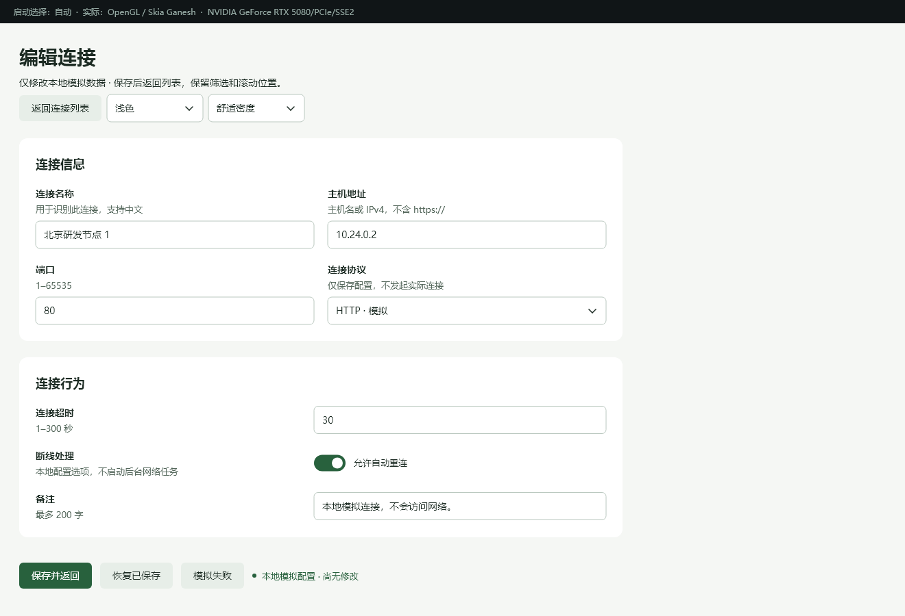

# OneUI

English | [简体中文](README.md) · [MIT](LICENSE) · C++17 · 0.1 development

**Build native desktop interfaces in C++, with layout, themes and data binding handled by OneUI.**

Compose widgets in C++, or describe the same page with `.one` templates. Both share C++ business logic and a retained native widget tree. State changes update properties; pages are not rebuilt every frame. Rendering uses Skia, without JavaScript or a WebView.

OneUI suits settings tools, connection managers, operations consoles, and applications with many forms, tables and charts. The new authoring path is validated on **Windows with C++17**. APIs are still evolving.

## Running examples

Default light form with responsive columns:



Dark compact table with 1,000 simulated records:


Charts, particles, scrolling and live process metrics:


These are native client captures from the repository examples. See the [validation report](docs/40-declarative-stage-validation.md) for narrow layouts, error states, measurements and limitations.

## Run on Windows

Install Git, Python 3, PowerShell, and Visual Studio / Build Tools with **Desktop development with C++**, Windows SDK, CMake and Ninja. Examples require CMake 3.20+. The first Skia download/build is substantial; page edits subsequently use incremental builds. Node.js is not required.

```powershell
git clone https://github.com/too1soft/OneUi.git
cd OneUi

# Once: locate VS/SDK and build the pinned Skia dependency.
$vswhere = "${env:ProgramFiles(x86)}/Microsoft Visual Studio/Installer/vswhere.exe"
$vs = & $vswhere -latest -requires Microsoft.VisualStudio.Component.VC.Tools.x86.x64 -property installationPath
$sdk = (Get-ItemProperty 'HKLM:\SOFTWARE\Microsoft\Windows Kits\Installed Roots').KitsRoot10
.\scripts\build-skia-static.ps1 -Fetch -SyncDeps -Generate -Build -WinVc "$vs/VC" -WinSdk $sdk

# Default components, themes, responsive forms and density
.\examples\performance_lab\run.ps1 -Build -Components

# Charts, particles, virtual list and metrics
.\examples\performance_lab\run.ps1

# Learn: settings, validation, async saving and connection list
.\examples\declarative\run.ps1 -Build -Dev

# Full workflow: list → details → editor, light by default
.\examples\performance_lab\run.ps1 -Connections -Entry template -Dev
```

Skip the Skia step if the matching dependency already exists in `third_party/skia/out/oneui-win-x64-release`. Initial builds download dependencies from Skia, Chromium and GitHub; Yoga is pinned and hash checked. The Skia script accepts `-Proxy`. See the [build guide](docs/12-getting-started.md) for other toolchains.

`-Build` rebuilds; `-Test` builds and runs regressions; `-Dev` watches styles. Close the application before rebuilding its DLL. Regression tests additionally download pinned Unicode/font fixtures. Examples use local simulated data and discard it on exit; they do not connect to servers.

If VS is not found, check the C++ and CMake installation components. Missing `skia.lib` or text modules means the Skia step needs completing. Details: [learning example](examples/declarative/README.md), [performance lab](examples/performance_lab/README.md).

## Start with one input

[hello.cpp](examples/declarative/hello.cpp) is a complete small program: a named input and a preview share one `State<std::wstring>`. Build and run it:

```powershell
.\examples\declarative\build.ps1
.\examples\declarative\build\bin\oneui-hello.exe
```

Use the typed C++ builder for a labeled input and live preview:

```cpp
oneui::ui::Compose ui(app.mount()); // #include <oneui/ui_compose.h>
auto page = ui.settingsPage({
    ui.field(L"Name", ui.input(name)).hint(L"Changes appear below"),
    ui.text(name)
}).title(L"Settings");
oneui::ui::applyTheme(app.mount());
return app.run(page);
```

`ui.input(name)` binds both directions; `ui.text(name)` observes state. Field/page components handle labels, spacing, content width and scrolling. Compose delegates to the existing Mount; `make/set/model/bind` remain available. Unsupported properties and wrong binding types fail at compile time. See the [typed API, defaults and measurements](docs/50-typed-authoring-and-defaults.md) (Chinese).

Next, run `examples/declarative/build/bin/oneui-details.exe`: [details.cpp](examples/declarative/details.cpp) is a standalone C++ example of responsive fields, read-only text, bottom actions and theme switching without manual field coordinates. The lab now supports list → details → edit, preserving filters and scroll position; saving from details returns to the same record. See the [page recipes](docs/48-connection-page-recipes.md) and [validation limits](docs/49-connection-workflow-validation.md) (Chinese).

For a full application, [manual.h](examples/declarative/manual.h) contains the C++ composition, [Demo.one](examples/declarative/views/Demo.one) contains the equivalent template, and [vm.h](examples/declarative/vm.h) contains shared state, validation and commands. A ViewModel is simply the C++ class that owns this page data and behavior.

## Prefer templates and CSS?

```html
<SettingsPage title="Connection settings">
  <Section title="General">
    <FormGrid>
      <FormRow label="Name"><Input v-model="name" /></FormRow>
      <FormRow label="Host"><Input v-model="host" /></FormRow>
    </FormGrid>
  </Section>
</SettingsPage>
```

Declare `name` and `host` as `State<std::wstring>` members in your C++ ViewModel. `oneui-viewc` generates C++ during the build. FormGrid wraps to one column when space is tight; application code does not need to calculate field coordinates.

| Task | API or file |
|---|---|
| Pick a page layout | SettingsPage / ListPage / DetailPage |
| Arrange labeled fields | FormRow; FormGrid for automatic columns |
| Change color, spacing or typography | External CSS or `<style scoped>`, with `-Dev` |
| Dark / compact appearance | `ui::applyTheme(app.mount(), true, ui::Density::Compact)` |
| Derived values and validation | C++ `Computed` |
| Actions, running state and errors | `VmCommand`, bound through `@click="save"` |
| Large lists | DataTable and stable business IDs; visible rows are drawn |

Successful CSS edits replace the rules; invalid edits retain the last valid style. Input, focus, caret and valid scrolling state survive. **Template structure, events and C++ changes require a rebuild.** This is not full Vue or browser CSS Grid, and templates do not evaluate JavaScript. See the [authoring API](docs/35-declarative-authoring-v1.md) and [layout guide](docs/36-declarative-page-patterns.md).

## Performance

The 2026-09-28 typed-authoring regression measured **3.260 / 3.263ms** mean CPU paint and **100.28 / 99.60MiB** working set for C++ / templates. Equivalent page-construction code shrank **38.5%**, excluding the shared wrapper; widget and subscription counts stayed unchanged. No material runtime regression was observed across three rounds. This workload differs from the historical results below. [Matched before/after samples and methodology](docs/50-typed-authoring-and-defaults.md#代码量与实测).

Measured 2026-09-27 on Windows 10, Ryzen 9 9950X3D (32 logical processors), RTX 5080, MSVC Release, OpenGL + Skia Ganesh. Both entries used the same exe/DLL, a 1320×900 client and 1,000 seeded records. Three alternating rounds each warm up for 50 cycles, then measure 150 search/edit/discard cycles. Style watching and render tracing are off.

| Metric (three-run mean) | C++ entry | `.one` entry |
|---|---:|---:|
| Process CPU, whole-machine % | 3.19% | 3.20% |
| Mean CPU paint | 4.04 ms | 4.04 ms |
| Mean of per-run paint P95 | 8.17 ms | 8.18 ms |
| Working set | 100.12 MiB | 100.38 MiB |
| Private bytes | 142.77 MiB | 142.91 MiB |
| Extra paints in 5s settled idle | 0 | 0 |

No material template runtime overhead was observed in this run; three rounds do not establish significance for small differences. Paint measures CPU widget traversal, not GPU time or displayed FPS. Idle results apply to the connection page; chart/particle scenes continuously animate. This is not a GPUI comparison or a low-end hardware claim. [Raw data, hashes and reproduction](docs/40-declarative-stage-validation.md#性能测量).

### CPU or GPU?

Windows prefers GPU and falls back to software. Start the lab with `-Renderer gpu`, `-Renderer cpu`, or `-Renderer auto` (inherits the environment); restart to switch. The window reports the actual backend and device/reason.

On the same build, three table-scroll rounds averaged **7.62 / 0.95ms CPU-side paint time** and **53.50 / 120.52MiB working set** for CPU / GPU. Both modes produced no additional idle connection-page paints. GPU rendering was faster but used more process memory. These are neither GPU timestamps nor display FPS. Run `examples/performance_lab/compare-renderers.ps1 -Rounds 3 -Seconds 5`; see the [four-scene results and raw data](docs/41-renderer-selection-and-product-boundaries.md).

A previous three-round baseline on the same machine with **10,000 particles** measured **31.35 / 5.39ms** CPU-side paint time for CPU / GPU. Measure the current version with `compare-renderers.ps1 -Load heavy`. Results also expose Skia cache accounting, distinguishing limits from usage and process memory. See [heavy-load baseline and memory diagnostics](docs/43-heavy-renderer-diagnostics.md).

A subsequent five-round, same-binary A/B test reduced GPU paint time from **5.43 to 5.08ms (6.4%)** using precomputed constants and ordered bulk drawing, with exact raster and actual OpenGL pixel parity. This was the previous default; `-ParticleMode reference` selects the original loop. Software paint improved by less than 1%, and reusable buffers add a small amount of memory. [Four variants, raw results and reproduction](docs/44-particle-drawing-optimization.md).

The performance demo now defaults to **indexed mesh particles** on GPU, with ordered bulk drawing as the software/unsupported-input fallback. Select `-ParticleMode combined` for comparison. The corrected mesh passes strict RGB parity in 18 full scenes and 36 focused cases on the tested machine. The previous five-round A/B measured CPU-side GPU-path paint time at **5.23 → 4.17ms (20.4% lower)**. Normal SDK controls are unaffected. [Default behavior and stability validation](docs/47-particle-mesh-default.md) · [Pixel and A/B evidence](docs/46-particle-mesh-parity.md).

Custom caption geometry and line-art glyphs use [TitleBarPresentation](docs/42-titlebar-presentation.md) in C++/C/Rust. CSS variants no longer select product-specific geometry.

## Scope and maturity

The declarative authoring/default component stage delivers shared bindings and commands, template compilation, strict CSS diagnostics and hot reload, light/dark themes, two densities, responsive forms and runnable examples. Real **125%/150% system DPI, cross-monitor movement and native Chinese IME candidate windows** remain unverified. Internal layout/composition tests do not substitute for those checks. Particle drawing/submission optimization is separate future work.

Existing Widget/View APIs and the default Stack path remain available. Yoga is opt-in and enabled by the new examples. This iteration prioritizes C++; existing C ABI and Rust wrappers do not imply equivalent new template APIs.

Windows is the primary platform. Linux X11/Wayland has built and run under WSLg; native Linux desktop acceptance is pending. Cocoa sources are integrated but await a Mac build. Consult the [platform matrix](docs/37-native-desktop-backends.md).

## References

- [Stage validation and reproducible measurements](docs/40-declarative-stage-validation.md)
- [Detailed capability reference](docs/capabilities-reference-en.md), [component inventory](docs/07-component-inventory.md), [component APIs](docs/14-component-reference.md)
- [Build/integration](docs/12-getting-started.md), [C ABI](docs/c-abi-integration.md), [Rust](bindings/rust/README.md)
- [Architecture](docs/01-architecture.md), [rendering](docs/39-rendering-and-validation.md), [accessibility](docs/15-accessibility.md)

Public headers live in `include/oneui/`, widgets in `src/core/`, the template compiler in `tools/viewc/`, examples in `examples/`, and regressions in `tests/`. See [LICENSE](LICENSE) and [third-party notices](third_party/README.md).
