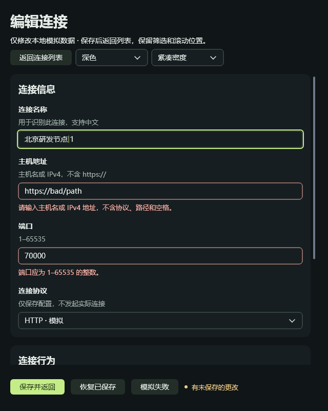

# 声明式开发与默认组件：阶段验收

日期：2026-09-27。本次作为**开发体验与默认组件阶段**提交，不作为完整跨平台／DPI／输入法或粒子性能优化的完成声明。

## 交付内容

- C++ 与 `.one` 共用响应式状态、Mount、组件适配层和原生控件树；显式依赖的 Computed、可选 Batch、可取消投递的异步命令与状态。
- 模板编译器、源定位、静态属性、绑定、事件、条件、稳定 key、组件导入与插槽；不引入 JS／WebView。
- 严格 CSS 诊断、消费检查、作用域样式、200ms 防抖与原子替换；错误回滚、删除规则、保留输入和有效列表状态。
- 语义页面、默认浅／深主题、舒适／紧凑密度、FormGrid 自动分栏，长中文换行、错误／禁用／加载／空状态与焦点样式。
- 仓库内 [学习示例](../examples/declarative/README.md) 与 [性能实验台](../examples/performance_lab/README.md)，便携构建／运行入口及原生截图。

原有低层 Widget／View、默认 Stack 和应用默认主题保持可用。新作者入口显式使用 Yoga。应用表单层不调用 setFrame；综合图表压力场景保留其已有自定义绘制布局。Rust 对等声明式入口、完整 Inspector、项目脚手架和粒子批量渲染不在本次范围。

## 如何验证

从待提交内容建立独立的干净工作区，排除了工作区内其他终端、表格、字体和工作台改动。MSVC x64 Release、同一固定 Skia 依赖下重建两套示例及回归。没有从原工作区复制 OneUI DLL。

```powershell
.\examples\performance_lab\build.ps1 -Test
.\examples\declarative\build.ps1 -Test
```

| 覆盖 | 本轮结果 |
|---|---|
| SDK／声明式 | 14 项 CTest 全部通过：runtime、compiler、frame profile、interaction、reactive lifetime、control、scroll、stack、authoring、Yoga、component、MSAA、窗口循环、ABI 清单 |
| 编辑业务 | 校验、保存点击时快照、后台取消／释放、输入状态与焦点滚动通过 |
| 列表业务 | 代码／模板各 300 次循环，117 控件、50 Mount 订阅、115 样式节点，未持续增长 |
| 入口一致性／热更新 | 30 组场景绘制指令一致；错误回滚、删除规则、scoped、输入保留、50 次替换、200ms 防抖通过 |
| 默认组件 | 2 主题 × 2 密度 × 3 宽度（1320／640／426）× 3 页面类别，共 36 组布局通过；40 次外观切换保留焦点、光标、组合状态、订阅和表格顶部行 |
| 模板诊断 | 有效语法、无效属性／事件／表达式、源映射、插槽、条件、重复 key、FormGrid 限制通过 |
| 原生截图 | 六张表单／列表／反馈截图，布局报告均为 No layout issues；另有综合图表截图 |

记录：[CTest](benchmarks/declarative-20260927/build-declarative.txt)、[实验台回归](benchmarks/declarative-20260927/build-lab-final.txt)。这些是相关回归集合，不是全仓库所有测试。本次没重新下载编译 Skia，复用了其已校验的固定源码和库。

此前真实窗口已验证 Tab、Enter、方向键、Esc，修复了静止鼠标悬停重放覆盖下拉框键盘选择的问题。此项现在也在 gallery 回归中覆盖。中文粘贴与内部组合输入状态测试已通过，但系统 IME 候选窗口未验收。

## 性能测量

2026-09-27，Windows 10、Ryzen 9 9950X3D（32 逻辑处理器）、RTX 5080、MSVC Release、OpenGL + Skia Ganesh。使用同一 exe/DLL、1320×900 窗口、1,000 条固定数据，交替执行三轮搜索／编辑／取消流程；每轮先预热 50 次，再测 150 次。开发监听与渲染追踪关闭。

| 指标（三轮平均） | C++ 代码入口 | `.one` 模板入口 |
|---|---:|---:|
| 进程 CPU，占整机比例 | 3.19% | 3.20% |
| CPU 侧 paint 平均 | 4.04 ms | 4.04 ms |
| 每轮 paint P95 的平均 | 8.17 ms | 8.18 ms |
| 工作集 | 100.12 MiB | 100.38 MiB |
| 私有提交内存 | 142.77 MiB | 142.91 MiB |
| 稳定后 5 秒额外 paint | 0 | 0 |

本次未观察到明显的模板运行开销；三轮结果不足以证明微小差异有统计意义。paint 是 CPU 侧控件绘制遍历，不是 GPU 执行时间或屏幕帧率。空闲结果仅针对连接页，图表／粒子页本来就持续动画。这不是 GPUI 对比，也不代表低配机器性能。

工作集是当前驻留页，私有提交量是 Windows PrivateUsage；二者不能相加。CPU 以进程 CPU 时间／墙钟／32 归一化。表中 P95 是三轮各自 P95 的算术平均，不是合并所有样本后的 P95。测量包含框架、渲染、文字、模拟业务和运行环境成本；不代表最小程序内存。

从原始记录计算，模板相对代码平均 paint 差 +0.11%，工作集差 +0.25 MiB。应看作此次测量的接近结果，不作普遍性能保证。

复现前关闭其他性能实验台，执行：

```powershell
.\examples\performance_lab\compare-entries.ps1 -Rounds 3 -Cycles 200
```

[六轮汇总 CSV](benchmarks/declarative-20260927/summary.csv)、[环境与二进制 SHA-256](benchmarks/declarative-20260927/environment.json)、逐 paint 样本和每 50 轮内存／订阅记录都在 [原始数据目录](benchmarks/declarative-20260927)。源码内容清单在同目录，便于对应本次提交；绝对构建路径可能影响二进制哈希。

### 综合场景的额外重绘修复

迁入仓库时发现旧综合实验台仍在 paint 内更新指标文字。本次把文字与采样状态更新移至 tickAnimations，paint 只保留遥测采样和绘制。没有减少粒子／曲线数据或丢弃框架失效请求。

修复后的 3 秒预热 + 3 秒采样探针确认使用 RTX 5080 OpenGL/Ganesh，全部输出桶 `paint_invalidations=0`、`partial=0`。见 [原始渲染日志](benchmarks/declarative-20260927/overview-render.txt)。该探针开启了追踪，不能与上方未追踪的数据混为同一测量，也不作为 GPUI 性能对照。大量图元逐次绘制和提交的优化仍未实施。

## 截图

使用新构建捕获的原生离屏客户端图像，不是浏览器或设计稿。宽窗口 1320×900，窄窗口 640×800。

| 场景 | 图片 |
|---|---|
| 浅色舒适表单、双列 | [form-light-wide.png](images/performance-lab/form-light-wide.png) |
| 深色紧凑表单、单列 | [form-dark-narrow.png](images/performance-lab/form-dark-narrow.png) |
| 深色紧凑千行表格 | [table-dark-wide.png](images/performance-lab/table-dark-wide.png) |
| 浅色反馈、禁用和空状态 | [states-light-narrow.png](images/performance-lab/states-light-narrow.png) |
| C++ 实际连接编辑页 | [editor-wide.png](images/performance-lab/editor-wide.png) |
| 模板窄窗口与错误提示 | [editor-narrow.png](images/performance-lab/editor-narrow.png) |
| 综合图表／粒子／列表 | [overview.png](images/performance-lab/overview.png) |



截图命令见 `examples/performance_lab/capture-gallery.ps1`。综合图截图通过 exe 的 `--snapshot <绝对路径> --snapshot-exit` 生成。截图中的瞬时指标不是基准汇总。

## 留到下一阶段的验收

- 实际系统 125%／150% DPI、跨显示器拖动、中文输入法候选窗口；426 逻辑像素布局和组合输入状态回归不能替代。
- Windows 原生 UIA patterns／屏幕阅读器全面验收；目前仅提供初步 MSAA 桥。
- Linux／macOS 的新作者入口原生运行验收。
- 粒子批量绘制、提交成本和同配置 GPUI 公平对照。

因此可以结束并提交当前组件／开发体验阶段，同时继续把上述内容列为未完成，不称“所有性能瓶颈已修复”。
