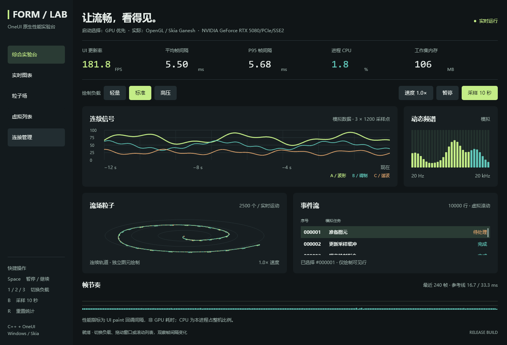

# 渲染模式、CPU/GPU 基准与框架边界

本轮从 `2d4c168` 的独立工作区实现、构建和测量，避免把本地其他任务的未提交终端／工作台改动混入结果。旧分支未删除。

## 选择渲染模式

在仓库根目录启动：

```powershell
.\examples\performance_lab\run.ps1 -Build -Renderer auto
.\examples\performance_lab\run.ps1 -Renderer gpu
.\examples\performance_lab\run.ps1 -Renderer cpu
```

每次先关闭上一窗口再运行。此处是启动选择，不是运行中切换。exe 对应参数为 `--renderer auto|gpu|cpu`，可与 `--view connections`、`--view components` 等组合。

| 选项 | 行为 |
|---|---|
| auto | 保留启动进程继承的 ONEUI_ENABLE_GPU；未指定时 GPU 优先 |
| gpu | 在当前应用进程中设置 ONEUI_ENABLE_GPU=1，尝试 GPU；失败允许回退 |
| cpu | 在当前应用进程中设置 ONEUI_ENABLE_GPU=0，明确使用软件路径 |

显式模式不会修改系统环境或父 PowerShell 的变量。GPU 优先不等于“失败即终止”；对比脚本会检查实际后端并拒绝把回退样本当 GPU 数据。

窗口副标题显示启动选择、实际后端和 GPU 设备；软件模式区分明确禁用 GPU 与 GPU 失败回退，完整文字也在悬停提示中。连接／组件页顶部保留同一状态行，状态变更在绘制前提交。

## 应用如何读取实际状态

`Window::rendererInfo()` 是 UI 线程只读快照，不创建窗口、触发重绘或尝试切换后端。Win32 报告：

- `backend`：Unknown／Software／OpenGL。首次成功建立绘制 surface 后才报告实际路径。
- `device`：OpenGL GL_RENDERER 返回的设备信息；CPU 路径不会假装使用某张显卡。回退后可能保留曾尝试的设备文字，须结合 backend/reason 解释。
- `reason`：无失败时为空；明确软件选择为 `disabled-by-environment`。其他原因包括 DC、像素格式、OpenGL 上下文／绑定、Ganesh、GPU surface、SwapBuffers 或 raster surface 失败。
- `vsync`：OpenGL 交换间隔是否成功启用，不表示屏幕实际显示帧数。
- `paints`、`paintMs`、`contentMs`、`submitMs`、`blitMs`：累计 CPU 侧次数／毫秒；取两次快照差值得到采样区间。paint 包含内容和提交，不能将它们相加。
- `backendChanges`：用于检测采样期间后端转换；诊断查询本身不改变计数。

这是 C++ 源码接口扩展；使用新头文件应重建应用和 DLL。C ABI 版本和现有 Rust API 没有因此改变。其他后端暂返回 Unknown，不以其平台类型推断 GPU 状态。现有 Linux/macOS 软件渲染实现未在本轮变更。

## 可复现基准

```powershell
.\examples\performance_lab\compare-renderers.ps1 -Rounds 3 -Seconds 5
```

同一 exe/DLL、Release x64、1320×900、100% DPI、固定数据、默认标准负载；每次预热 3 秒、采样 5 秒，三轮交替 CPU／GPU 顺序。关闭 CSS watcher 和逐图元追踪。CPU 百分比按整机逻辑处理器数归一化；32 线程机器上的约 3.125% 可对应一个逻辑处理器持续繁忙。

| 场景 | 固定负载 |
|---|---|
| idle | 1,000 条连接的静止列表；采样无需持续重绘 |
| table | 同一原生虚拟表格；360 逻辑像素／秒的滚动轨迹，最多 60 次 UI 投递／秒 |
| chart | 标准图表、每条 1,200 采样点，使用原生动画调度 |
| particles | 2,500 个粒子，使用原生动画调度 |

图表／粒子不是强行固定 60 帧的负载：相同墙钟时间、数据与动画速度下，两条渲染路径可能完成不同数量的绘制。应一起看 paint_count、每次绘制成本和 CPU，而不只比较 CPU 百分比。

输出 `summary.csv`、环境／二进制哈希、逐次根控件绘制样本与实际 renderer 状态。脚本遇到后端不符、采样中回退、窗口尺寸或 DPI 变化会失败；失败前的部分 CSV 不属于完整对比结果。没有 GPU 时间戳、显存占用或输入到显示延迟的测量。

## 2026-09-27 实测结果

Windows 10 Pro 19045，Ryzen 9 9950X3D（32 逻辑处理器），RTX 5080（NVIDIA 581.80），MSVC Release x64。以下为三轮平均，全部 24 次采样后端符合请求且没有发生后端切换。

| 场景 | CPU / GPU 每次绘制 | CPU / GPU 进程 CPU | CPU / GPU 工作集 | CPU / GPU 私有提交 |
|---|---:|---:|---:|---:|
| 空闲连接页 | 0.00 / 0.00 ms | 0.00 / 0.00 % | 51.60 / 80.04 MiB | 31.71 / 122.89 MiB |
| 表格滚动 | 7.62 / 0.95 ms | 1.49 / 0.24 % | 53.50 / 120.52 MiB | 33.95 / 162.64 MiB |
| 图表 | 11.33 / 2.58 ms | 3.12 / 1.61 % | 50.14 / 122.14 MiB | 32.55 / 170.62 MiB |
| 2,500 粒子 | 12.55 / 1.91 ms | 3.12 / 1.25 % | 46.01 / 104.81 MiB | 27.79 / 152.27 MiB |

空闲两种模式在每次约 5 秒采样内均为 **0 次额外绘制**；其 0ms 代表没有绘制样本，CPU 0% 受进程计时分辨率限制。表格两种模式均完成每轮 300 次绘制，GPU 的单次 CPU 侧绘制约快 8.1 倍。

图表每轮平均绘制次数为 CPU 438 / GPU 910，粒子为 CPU 397 / GPU 910。它们是应用完成绘制次数，不是显示器 FPS，也不能将这些场景的进程 CPU 直接解读为固定帧率下的节省比例。

GPU 降低 CPU 绘制开销，但会增加驱动、上下文和缓存等进程内存。本轮 GPU 表格工作集在 102.11–157.21 MiB 间波动；表内是三轮采样末尾平均，并非峰值、显存占用或内存泄漏判断。数据不足以分摊每项缓存的贡献。

[完整汇总 CSV](benchmarks/renderers-20260927/summary.csv) · [环境与 exe/DLL SHA256](benchmarks/renderers-20260927/environment.json)。同目录保留逐轮 renderer-performance.txt 与 content-paint.csv。原始 P95 为根控件内容绘制样本；累计 content_mean 则来自 Window 内容绘制计时，两者范围略有不同。此前代码版／模板版报告使用另一套业务循环和控件遍历计时，不应直接横向比较毫秒值。

实际状态展示：



[CPU 宽窗口](images/renderers/cpu-wide.png) · [auto 继承软件设置、640px 窄窗口](images/renderers/auto-cpu-narrow.png) · [局部视觉复核](renderer-design-review.md)。这些是原生客户端离屏捕获；实际后端由运行中 Window 查询，不把截图当成 GPU 执行时间或物理显示验收。


## 产品边界审查

### 本轮已处理

- C++／Rust 测试中的产品标题改为 OneUI Demo，产品域名改为保留的 `example.test` 测试域；保留中文、emoji 和原有测试语义。
- 新增 `scripts/check-product-boundaries.py`，检查源码／构建依赖中的已知产品引用，以及核心标题栏按产品 variant 切换固定几何的分支。
- 文档中的下游接入历史、兼容锁文件中的来源路径，以及图标的来源注释保留。这些不是运行时业务依赖，不以抹掉出处充当迁移。
- 已提交图标是通用服务器、文件、布局等几何图标；没有将 iShellPro 应用、SSH/SFTP 实现或产品服务搬进 OneUI。

```powershell
# 当前源码，包括未忽略的未跟踪文件
python .\scripts\check-product-boundaries.py
# 精确检查某个提交，明确区别于当前工作区
python .\scripts\check-product-boundaries.py --revision HEAD
```

这是已知模式的静态检查，不是“零耦合”的形式化证明；未知品牌、间接依赖、泛化程度和资源许可仍需人工审查。

### 当时发现的本地改动（后续已迁移）

渲染基准阶段，原工作区的 `src/core/window_title_bar.cpp` 存在未提交的 `terminal`／`terminal-mac` 专用分支，包含与下游匹配的固定品牌位置、窗口按钮几何和 900px 断点。下游 `ishellpro-native-window/native-shell/src/product_shell.rs` 仍调用这些 variant，直接删除会破坏其尚未提交的界面。

这些分支没有纳入当时的干净渲染基准构建，并由新检查脚本报错。合回原工作区后检查实际得到 11 项：10 处专属 variant 分支，以及 1 处关联的未提交终端测试产品名。本轮保留原工作区和下游代码，**不宣称专属标题栏已迁移或整个工作区已清理完成**。后续应把布局／绘制策略经通用可配置接口注入，再将产品值迁回调用方；必须同时验证下游 Windows/macOS 风格标题栏的命中、窗口动作、主题和无障碍，不应靠把 variant 改名来通过检查。

后续迁移已将布局、颜色和图标路径移至下游配置模块，SDK 使用通用 TitleBarPresentation，当前工作区检查为 0 项。此前保留未迁移的说明是历史记录，不代表现在仍有专属分支。详见[接口与验证报告](42-titlebar-presentation.md)。本页渲染基准和哈希仍对应迁移前的测量构建，未据此宣称性能变化。

## 验证范围

已有编辑／连接／作者入口／组件回归继续执行。新增原生软件路径诊断回归覆盖首次 surface、明确软件选择、只读查询、累计计数和更新后计数；GPU 路径通过真实基准验证。未人为注入每一种驱动失败，回退原因的硬件故障端到端覆盖仍有限。

干净工作区与合并后的原工作区分别完成 Release 构建及 `build.ps1 -Test`：编辑回归、两种入口各 300 次连接流程、30 个作者入口场景与 50 次 CSS 热更新、36 个组件场景，以及新增软件渲染诊断全部通过。边界脚本自身测试通过；干净工作区扫描为 0 项，原工作区结果如上。上表与原始哈希只对应干净构建，不能混用合并后的本地二进制。

界面截图与本机实测用于本轮证据，不能替代跨驱动、真实 DPI、输入法和其他平台验收。此轮未实施粒子批量渲染。
