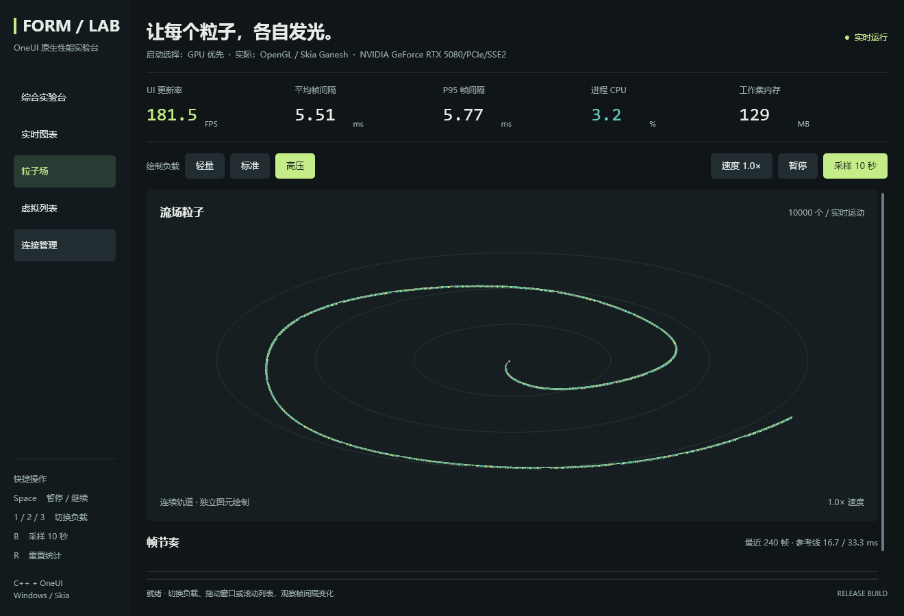

# 粒子预计算与批量绘制实验

本轮针对[高压诊断](43-heavy-renderer-diagnostics.md)中的粒子场景，分别测量常量预计算、批量接口，以及两者组合。保持 10,000 个粒子、动画公式、画面、绘制顺序和原有调度方式。

后续新增了[私有网格实验](45-particle-mesh-experiment.md)，但尚未通过 GPU 像素门槛；本页 combined 仍是默认方案，以下数据保留原测量口径。

## 四种模式

| 模式 | 实现 |
|---|---|
| reference | 保留原始逐粒子计算与绘制循环，作为同一二进制中的 A/B 对照 |
| precomputed | 按负载缓存半径、初始角度、角速度、大小与颜色，位置仍随时间逐帧计算 |
| batch | 原始计算方式，先填充可复用的绘制数组，再一次调用批量入口 |
| combined | 预计算与批量入口同时启用 |

三角函数仍按原公式计算，没有降低采样率、减少粒子或改变时间推进。缓存与绘制数组属于 Plot 实例，首次使用或负载变化时调整长度，不逐帧重建控件。10,000 粒子的常量有效载荷约 0.191MiB，绘制数组约 0.229MiB；两者合计约 0.420MiB/Plot，不含 vector 对象和分配器开销。降低负载后允许保留容量以便再次升档，不会按帧累积。

## 框架接口

```cpp
const oneui::RoundedRectFill items[] = {
    {{10, 20, 3, 3}, oneui::Color(196, 237, 135), 1.5f},
    {{12, 21, 1.6f, 1.6f}, oneui::Color(236, 173, 114), 0.8f},
};
canvas.fillRoundedRects(items, std::size(items));
```

`Canvas::fillRoundedRects` 的效果等价于按数组顺序调用 `fillRect`，包括重叠、透明度、圆角和当前裁剪。指针仅在调用期间借用；count 为零时可传 nullptr，非零时须提供对应数量的有效元素。不支持原生批量入口的 Canvas 子类自动使用逐项回退。

Skia 实现复用一个 SkPaint 和一次 Fill 分析区间，按原顺序调用相同的抗锯齿 `drawRRect`。这减少应用层虚调用、绘制状态初始化和分析区间开销，**不是把 10,000 个粒子变成一次 GPU draw call**；实际 GPU 合批仍由 Skia 决定。没有加入纹理图集、颜色排序或新的 GPU 缓存。

这是 C++ 接口扩展，应用和 DLL 要一起重建；C ABI 和 Rust C 绑定不变。

## 复现

```powershell
# 在仓库根目录运行。先关闭其他性能实验台和粒子测试窗口。
.\examples\performance_lab\build.ps1 -Test
.\examples\performance_lab\compare-particles.ps1 -Rounds 5 -Seconds 5

# 有可用 GPU 时，检查真实 OpenGL 前缓冲；回退软件会报错。
.\examples\performance_lab\build-current\bin\oneui-particle-tests.exe --gpu .\examples\performance_lab\results\particle-parity-gpu
```

对比脚本在同一 exe/DLL 下轮换四种模式、交替 CPU/GPU 顺序。每次独立进程预热 3 秒、采样 5 秒，40 次运行均使用 1320×900、固定高压数据，关闭 watcher 和逐图元追踪。测量期间不编译或并行跑测试。输出包含实际模式、后端、绘制／内容／提交时间、进程内存、Skia 缓存和二进制 SHA256。

## 本机结果与默认选择

2026-09-28，Windows 10 Pro 19045、Ryzen 9 9950X3D（32 逻辑处理器）、RTX 5080 / NVIDIA 581.80、MSVC Release x64、100% 系统 DPI。基于 `5391bfd` 的隔离工作区，只加入本轮实验代码。以下为五轮平均，所有请求均命中实际后端且没有中途切换。

| 模式 | CPU 每次绘制 ms | GPU 每次绘制 ms | GPU 内容 ms | GPU 提交 ms | CPU / GPU 工作集 MiB |
|---|---:|---:|---:|---:|---:|
| 原始 | 31.147 | 5.427 | 3.952 | 1.224 | 62.21 / 131.07 |
| 仅预计算 | 31.168 | 5.421 | 3.941 | 1.237 | 62.38 / 131.62 |
| 仅批量 | 30.955 | 5.201 | 3.780 | 1.245 | 62.61 / 132.66 |
| 组合 | 30.913 | 5.078 | 3.685 | 1.240 | 62.77 / 132.99 |

组合方案 GPU 每次绘制降低 **6.42%**，五轮分别降低 7.52%、6.45%、7.07%、5.02%、6.05%；内容绘制降低约 6.76%，提交没有改善。仅批量降低约 4.16%；仅预计算差异约 0.11%，不足以单独宣称收益。CPU 组合方案仅降低约 0.75%，并未解决软件绘制的主要瓶颈。

Demo 默认采用 **combined**；用以下命令重新启动可切换，进入左侧“粒子场”观察：

```powershell
.\examples\performance_lab\run.ps1 -Build -Load heavy -Renderer gpu -ParticleMode combined
.\examples\performance_lab\run.ps1 -Load heavy -Renderer gpu -ParticleMode reference
```

先关闭上一窗口再运行下一条。exe 参数为 `--particle-mode reference|precomputed|batch|combined`，可直接搭配 `--view particles`。原始模式仍保留在同一二进制中，方便以后在不同机器上重新验证；正常示例默认不启用诊断采样或样式监听。

GPU 的每轮绘制次数为原始 899 / 组合 904，整机归一化进程 CPU 为 3.46% / 3.23%；这些不是显示器帧率或 GPU 执行时间。总绘制已经包含内容和提交，不要相加。调度方式未改变，单次开销改善不保证显示帧率同比提升。

工作集原始/组合为 CPU 62.21/62.77MiB、GPU 131.07/132.99MiB；私有提交为 CPU 44.04/44.62MiB、GPU 182.19/183.81MiB。GPU 资源缓存均约 16.01MiB，预算仍是 256MiB。这里没有内存下降的结论；缓存数组增加了少量 CPU 内存，进程末尾快照还包含驱动等波动，不是峰值或泄漏测试。

[40 次原始汇总](benchmarks/particles-20260928/summary.csv) · [环境与二进制哈希](benchmarks/particles-20260928/environment.json)。同目录保留逐轮 `renderer-performance.txt` 和 `content-paint.csv`；测量后只调整默认选项和代码排版，四种模式的算法未变。结果只对应这次 Windows 硬件，不是新一轮 GPUI 对比。

## 画面与行为验证

- 120 组精确几何对比：轻／中／高负载切换及缩容、两种边界、0／1.25／300／3600 秒，逐个比较坐标、大小、颜色、圆角和顺序，并验证默认 Canvas 批量回退。
- 54 组软件 PNG 完全一致：640／1320 宽窗口，100%／125%／150% 内容缩放，三个固定时刻，三种优化模式分别对比原始模式。
- 54 组实际 OpenGL 前缓冲逐字节一致：使用窗口当前上下文读回，不以软件离屏截图代替 GPU 结果；拒绝后端回退、读回错误或空白帧。
- 场景另外覆盖有重叠的半透明圆角矩形、不同圆角与小数裁剪，以及基类空批次回退。

内容缩放覆盖相应像素尺寸与裁剪计算，不等同真实多显示器 DPI 切换验收。GPU 一致性结论限于本机驱动；其他平台通过基础接口回退保持语义，但未做本轮硬件测试。

隔离工作区和保留其他本地改动的原工作区均通过完整回归及实际 GPU 像素对比，产品边界扫描均为 0 项。原工作区的兼容性构建未混入上述性能结果。

完整 `build.ps1 -Test` 通过编辑、两种入口的连接流程、作者入口与热更新、组件展示、渲染诊断及新增粒子测试；[验证输出](benchmarks/particles-20260928/validation.txt)可查。最终默认配置在 CPU/GPU 两条路径均报告 combined，空闲连接页各 1 秒采样无额外绘制。没有在最终构建中重新测量新的五轮数据。

最终 Demo 的原生客户端捕获如下。顶部是 UI 更新间隔，不是本文的单次 CPU 侧绘制计时；截图本身走软件离屏捕获，GPU 像素等价性来自前述独立的真实前缓冲测试。



这次降低了调用和状态初始化成本，较重的逐图元记录／渲染与提交仍然存在。进一步大幅提速需要另外验证更深层的 GPU 批量几何或实例绘制，并继续检查抗锯齿、透明混合和遮挡顺序；当前成果不应宣传为已解决全部粒子瓶颈。
