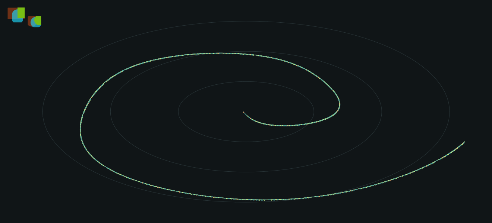

# 粒子网格实验：速度有收益，尚不替换默认路径

> 历史报告：以下实现、命令行为和数据对应 `d4f18cf`。后续修正已通过本机像素门槛，但性能收益也发生变化；当前状态见[网格画质修正报告](46-particle-mesh-parity.md)。

本轮把 10,000 个粒子合成一个三角形网格，使用 Skia `drawMesh` 提交，并在片元程序中计算圆形边缘覆盖。对照组是上一轮已默认启用的 `combined`，不是更早的原始逐粒子方案。

**决定：保留显式 `mesh` 实验选项，默认仍为 `combined`。** 本机 GPU 绘制耗时降低约 61.6%，但实际 GPU 图像不完全一致，严格 RGB 像素门槛未通过。普通 SDK 不编译这个实验，也没有增加公开 Canvas API 或 C ABI。

## 运行与复现

在仓库根目录准备好依赖后运行，每次先关闭上一实验台窗口：

```powershell
# 当前默认方案
.\examples\performance_lab\run.ps1 -Build -Load heavy -Renderer gpu -ParticleMode combined

# 显式选择实验方案；进入左侧“粒子场”观察
.\examples\performance_lab\run.ps1 -Load heavy -Renderer gpu -ParticleMode mesh

# 五轮、两种方案、CPU/GPU，共 20 个独立进程
.\examples\performance_lab\compare-particles.ps1 -Modes combined,mesh -Rounds 5 -Seconds 5
```

exe 参数为 `--particle-mode mesh`，可以搭配 `--view particles`。未指定时仍选择 combined。软件后端会回退到 combined 的保序圆角矩形批量入口，不假装执行 GPU 网格。

实际 GPU 画质检查：

```powershell
.\examples\performance_lab\build-current\bin\oneui-particle-tests.exe --gpu .\examples\performance_lab\results\mesh-quality --mesh
```

输出 `mesh-differences.csv` 和每个场景的 GPU 前缓冲 PPM。**当前预期退出码为 2：像素门槛未通过**，不能当成测试全绿。退出码 1 表示执行／后端／输入检查失败；退出码 0 才表示该检查通过。普通 `build.ps1 -Test` 继续检查默认路径，实验画质检查需要显式运行。

## 五轮实测

2026-09-28，Windows 10 Pro 19045，Ryzen 9 9950X3D（32 逻辑处理器），RTX 5080 / NVIDIA 581.80，MSVC Release x64。基于 `6929747` 的隔离工作区；同一 exe/DLL、1320×900、100% 系统 DPI、10,000 粒子，预热 3 秒后采样 5 秒，轮换方案和 CPU/GPU 顺序，关闭 watcher 和逐图元追踪。测量期间没有并行编译或测试。

| 指标（五轮平均） | combined / GPU | mesh / GPU |
|---|---:|---:|
| 每次绘制 CPU 侧总耗时 | 5.102ms | 1.960ms |
| 其中内容绘制 | 3.667ms | 1.028ms |
| 其中提交 | 1.262ms | 0.767ms |
| 每轮完成绘制次数 | 896.2 | 909.8 |
| 进程 CPU（整机归一化） | 3.21% | 1.24% |
| 采样末尾工作集 | 133.52MiB | 119.24MiB |
| 采样末尾私有提交 | 184.49MiB | 165.36MiB |
| Skia GPU 缓存 | 16.01MiB | 10.21MiB |

总绘制耗时降低 **61.58%**，约为对照组的 0.384 倍。总绘制已包含内容和提交，不能将各列相加。这不是 GPU 时间戳或显示器 FPS；两条路径仍使用原有动画调度，不能把耗时下降理解为显示帧率同比增加。没有重跑 GPUI 对比。

CPU 软件路径为 combined **30.980ms**、mesh 回退 **30.934ms**，差异很小，没有软件渲染提速的结论。正式 GPU mesh 采样中每次粒子绘制恰好提交 1 个 mesh、60,000 个顶点，回退次数为 0；这些计数是 SkCanvas 入口调用，不是驱动层 draw-call 计数，也不意味着整帧只有一次 GPU 绘制。

`mesh_*_sample` 只统计采样区间；`mesh_*_total` 包含启动和预热。每个 GPU mesh 进程启动阶段都有一次 `software-backend` 回退，正式采样没有回退，原始记录保留了这个区别。脚本拒绝采样期的 GPU 回退。

[20 次汇总](benchmarks/mesh-20260928/summary.csv) · [环境和二进制 SHA256](benchmarks/mesh-20260928/environment.json)。同目录保留逐轮 `renderer-performance.txt` 和 `content-paint.csv`。测量后补充了非法几何保护和实验门槛报告，未改变有效粒子的网格算法。

## 为什么还不设为默认

18 个实际 GPU 对比场景覆盖 640／1320 宽窗口、100%／125%／150% 内容缩放、0／1.25／300 秒固定时刻；同时绘制重叠的半透明圆、非整数裁剪和圆角矩形对照。

- 大多数场景最大 RGB 通道差异为 1～3/255，说明与原 Skia 圆角矩形抗锯齿不完全一致。
- 640 宽、150% 内容缩放、300 秒场景中有 2 个像素的差异超过 3/255，最大 **34/255**；该场景总计 10,390 个像素存在非零差异。
- 每场景全图平均 RGB 通道绝对差为 0.00037～0.01116/255。全图均值很小不能掩盖局部较大偏差，因此不据此放宽门槛。
- CPU 回退的 18 个图像场景与 combined 完全一致；160 组几何／顺序测试通过。非圆形、无效指针组合和超量请求有拒绝检查，空批次不生成顶点。

[完整差异 CSV](benchmarks/mesh-20260928/mesh-differences.csv) · [画质门槛输出](benchmarks/mesh-20260928/quality-gate.txt)。差异来自真实 OpenGL 前缓冲读回，不是软件离屏模拟。

网格版与对照版的固定画面如下。左上角的形状用于覆盖透明混合和裁剪，不属于 Demo 产品界面。图片不能替代逐像素检查。



[同场景 combined 对照](images/mesh/combined.png) · [出现最大差异的场景](images/mesh/mesh-outlier.png) · [该场景的对照](images/mesh/combined-outlier.png)

## 实现范围与内存口径

只有性能实验台 CMake 为渲染目标定义 `ONEUI_CIRCLE_MESH_EXPERIMENT`，通过 `src/platform/shared/circle_mesh_experiment.h` 的私有接口调用。普通 SDK 构建不包含该接口导出；没有改变 `fillRoundedRects` 的公开语义，其他控件不会自动走近似的网格路径。

当前只接受正的均匀缩放／平移、有效圆形输入和最多 16,384 个粒子。每圆按原始顺序生成两个三角形，保留 source-over 混合顺序；没有按颜色排序或使用纹理图集。不支持的 Canvas、软件后端、变换或输入会在提交前返回失败，调用方再用原接口绘制。

10,000 粒子的顶点有效载荷约 1.37MiB，线程暂存区复用；每次提交复制为独立 SkMesh CPU 缓冲，避免后续帧覆盖 GPU 尚未消费的数据。这不是零分配方案，也不是实例绘制。顶点上传和驱动仍可持有其他内存；Skia 缓存、工作集和私有提交不能相加或相减归因。

正式五轮 mesh 工作集为 119.13～119.36MiB，但早期一次因预热回退计数被脚本拒绝的[预运行记录](benchmarks/mesh-20260928/preflight/renderer-performance.txt)曾出现 **175.29MiB** 工作集。该不完整分组未纳入正式平均，其[构建哈希](benchmarks/mesh-20260928/preflight/environment.json)单独保存。末尾快照不能代表冷启动峰值，也不能保证每次运行都节省相同内存；尚未做长时间驻留／泄漏测量。

## 验证结论

默认路径的完整示例回归与实际 GPU 54 组精确像素比较通过，mesh 软件回退 18 组比较通过。普通 SDK 独立构建及控件、标题栏、C ABI 行为、C ABI 工作区四套 CTest 通过；DLL 导出检查确认普通 SDK 无实验接口，实验台 DLL 才有私有桥接。

集成回原主工作区后，完整示例回归、默认 GPU 54 组和 CPU 回退 18 组再次通过；实验 GPU 检查仍按预期返回 2。原有 47 个文件中的未提交改动保留，产品边界扫描无发现。

**Mesh 的 GPU RGB 门槛仍是失败状态。** 下一项工作应定位局部抗锯齿偏差并补充不同驱动和更长运行时间的证据，之后再决定是否推广为通用能力；不应因速度提升而直接改掉默认画面。
