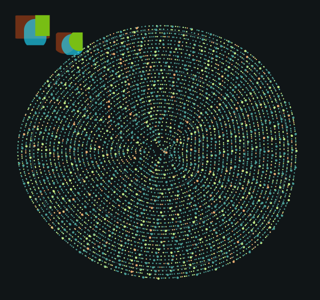

# 粒子网格画质修正：先保持画面，再衡量收益

修正后的 `mesh` 已通过本机 **18 个完整粒子场景 + 36 个定向场景**的严格 RGB 比较，差异像素数和最大通道差异均为 0。没有放宽误差阈值，也没有让 GPU 测试偷偷回退到旧路径。默认仍为 `combined`；网格继续仅在性能实验台中显式启用，普通 SDK 不编译该实验。

## 偏差来源与修正

上一版最大 34/255 的差异出现在 640 宽、150% 内容缩放、300 秒场景。拆出两个粒子后发现，单独绘制其中一个也能复现偏差，因此不能简单归因于粒子之间的混合顺序。

输入虽然是宽高 1.6、半径 0.8，但 `x + width` 和 `y + height` 的浮点取整可能让实际 SkRect 比直径稍宽。Skia `MakeRectXY` 会将其中一部分保留为圆角矩形，内部存在非常窄的条带。旧网格把这些输入全部当成数学圆，用两个三角形覆盖，与原生路径的几何和插值不同。

修正版按相同的 SkRRect 分类生成几何：真正的圆采用八边形与中心顶点，圆角矩形采用 4×4 顶点的九宫格，保留角、边、中心的绘制顺序。颜色也在 CPU 侧转换为 8 位预乘值，匹配原生顶点颜色。没有修改第三方 Skia，也没有改变默认 `fillRoundedRects` 的行为。

初步直接展开所有三角形虽然通过画质检查，但一次预跑为 **9.14ms**，慢于同轮 combined 的 **5.03ms**，因此没有交付那个实现。最终使用索引复用顶点，并在 16 位索引容量范围内拆分网格；所有批次验证、建立独立缓冲后才统一提交，避免后面的非法输入导致前面的粒子已画出，再被回退路径重复绘制。

实现依赖本仓库当前 Skia M150 Ganesh 的几何路径。这是针对本机后端的兼容修正，不是对所有 Skia 版本和驱动的逐像素承诺。

## 重新测量

2026-09-28，Windows 10 Pro 19045、Ryzen 9 9950X3D、RTX 5080 / NVIDIA 581.80，MSVC Release x64。隔离工作区基于 `d4f18cf`，相同 exe/DLL，10,000 粒子，1320×900，100% 系统 DPI，预热 3 秒、采样 5 秒，轮换模式和后端顺序，关闭 watcher／逐图元追踪；测量期间没有并行构建或测试。

| 指标（五轮平均） | combined / GPU | 修正版 mesh / GPU |
|---|---:|---:|
| 每次绘制 CPU 侧总耗时 | 5.233ms | 4.167ms |
| 其中内容绘制 | 3.805ms | 2.702ms |
| 其中提交 | 1.251ms | 1.298ms |
| 进程 CPU（整机归一化） | 3.408% | 2.654% |
| 采样末尾工作集 | 133.053MiB | 126.249MiB |
| 采样末尾私有提交 | 184.162MiB | 174.259MiB |
| Skia GPU 缓存 | 15.982MiB | 13.086MiB |
| 每轮绘制次数 | 900.400 | 904.400 |

修正版总绘制耗时为 **5.23 → 4.17ms，降低约 20.4%**。CPU 软件路径为 31.048 → 31.187ms，仍是回退，没有软件加速结论。GPU 正式采样每次粒子绘制提交 2 个索引网格，采样期回退为 0；启动阶段的 1 次软件回退仍计入 total 指标。网格数量随实际几何变化，画质测试中的部分场景需要 3 个。

这是 CPU 侧绘制／提交耗时，不是 GPU 时间戳或显示帧率。总耗时已包含内容和提交。内存是进程末尾快照，各种内存口径不能相加归因；没有据此声称消除了内存峰值。没有重跑 GPUI 对比。

[20 次正式测量](benchmarks/mesh-parity-20260928/summary.csv) · [环境及二进制 SHA256](benchmarks/mesh-parity-20260928/environment.json) · [未采用的展开三角形预跑](benchmarks/mesh-parity-20260928/expanded-triangle-pilot/summary.csv)。预跑数据未纳入正式平均。

## 运行与验证

```powershell
# 在 OneUI 仓库根目录，构建并运行实验台
.\examples\performance_lab\run.ps1 -Build -Load heavy -Renderer gpu -ParticleMode mesh

# 实际 GPU 检查：当前本机应返回 0
.\examples\performance_lab\build-current\bin\oneui-particle-tests.exe --gpu .\examples\performance_lab\results\mesh-quality --mesh

# 软件回退也必须保持精确一致
.\examples\performance_lab\build-current\bin\oneui-particle-tests.exe --cpu .\examples\performance_lab\results\mesh-cpu --mesh

# 复测：五轮，两种方案、两种后端，共 20 个进程
.\examples\performance_lab\compare-particles.ps1 -Modes combined,mesh -Rounds 5 -Seconds 5
```

进入实验台左侧“粒子场”查看。传入 `-ParticleMode combined` 可切回默认方案；切换后请关闭前一个窗口再比较。

GPU 检查使用真实 OpenGL 前缓冲读回。18 个场景覆盖 640／1320 宽、100%／125%／150% 内容缩放及三个固定时刻；36 个定向场景覆盖单粒子、重叠、倒序、255／160／64 透明度，以及准备了前一批网格后才遇到非法输入的原子回退。内容缩放不等同于在三种 Windows 系统 DPI 下完整验收。

退出码 0 为通过，2 为 RGB 差异门槛失败，1 为后端、输入或运行错误。GPU 场景不接受软件回退。CPU 回退的完整场景与定向场景均通过；默认路径仍通过完整示例回归、160 组几何／回退测试和 54 组实际 GPU 像素比较。

[完整粒子差异 CSV](benchmarks/mesh-parity-20260928/mesh-differences.csv) · [定向场景 CSV](benchmarks/mesh-parity-20260928/mesh-fixtures.csv) · [验证日志](benchmarks/mesh-parity-20260928/validation.txt)

下图是原先最大差异场景的修正版真实 GPU 读回；[combined 对照图](images/mesh-parity/combined.png)与其 RGB 完全一致。左上角是混合／裁剪测试图形，不是 Demo 页面布局。



集成回原主工作区后，完整示例回归、默认 GPU 54 组、mesh GPU 与 CPU 各 18 + 36 组检查再次通过。产品边界扫描无发现。

## 仍保留的限制

仅支持当前私有接口规定的圆形输入、正的均匀缩放／平移及最多 16,384 粒子；软件后端、不适用的几何和不可表示的边界会在提交前拒绝，由调用方回退。没有新增公开 Canvas API 或 C ABI。

每个粒子需要 9 或 16 个顶点、24 或 54 个 16 位索引；每个顶点 24 字节。线程暂存区复用，但提交缓冲仍逐批复制，供 GPU 延后消费。`mesh_draws_sample` 现在记录实际 SkCanvas 网格提交次数，可能高于 `paint_count`；顶点数也随原生形状分类变化，不再固定为每粒子 6 个。它们都不是驱动层 draw-call 计数。

目前没有跨 GPU／驱动、长时间驻留和冷启动内存峰值的结论。默认保持 combined，等这些证据补齐后再决定是否推广；历史第一版的 61.6% 性能收益不再代表当前修正版。
