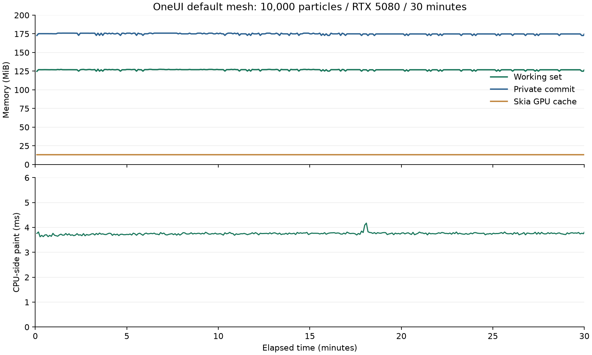

# 性能实验台：默认 Mesh 与稳定性验收

性能实验台现在默认选择 `mesh`。GPU 粒子场使用索引网格；软件后端或不支持的几何会回退到 combined 的保序批量绘制。可用 `-ParticleMode combined` 显式选择对照方案。

这个默认值只作用于性能 Demo 的粒子组件，不会让普通 SDK 的按钮、文字、表格自动改用网格。普通 SDK 不编译该私有桥接，也不包含下面的故障注入开关。

## 直接体验

在 OneUI 仓库根目录：

```powershell
# 默认 mesh，不需要额外选模式；启动后进入左侧“粒子场”
.\examples\performance_lab\run.ps1 -Build -Load heavy -Renderer gpu

# 保留原生批量路径作对照
.\examples\performance_lab\run.ps1 -Load heavy -Renderer gpu -ParticleMode combined

# 验证软件回退
.\examples\performance_lab\run.ps1 -Load heavy -Renderer cpu
```

先关闭上一窗口再启动对照。修正版此前在同机五轮比较中，GPU 路径的 CPU 侧绘制耗时 **5.23 → 4.17ms，降低约 20.4%**；本轮主要验证默认行为与稳定性，没有将长期运行的单组数据当成新的 A/B 提速结果。[画质修正及五轮比较](46-particle-mesh-parity.md)。

## 30 分钟固定负载

2026-09-28，Windows 10 Pro 19045、Ryzen 9 9950X3D、RTX 5080 / NVIDIA 581.80，Release x64。基于 `4a3d3df` 的隔离工作区，1320×900、100% 系统 DPI、10,000 粒子；预热 3 秒后固定负载测量，未并行编译或运行其他性能测试。

实际采样 **1800.17 秒**，342 条间隔记录，累计 **327,180 次绘制、654,531 次 SkCanvas 网格提交**。运行正常结束，采样期 **0 次 GPU 回退、0 次后端变化**；启动预热前的 1 次软件离屏绘制单独记在元数据中。

| 指标 | 第 60–360 秒 | 最后 300 秒 |
|---|---:|---:|
| 每次绘制 CPU 侧耗时 | 3.717ms | 3.761ms |
| 工作集 | 126.821MiB | 126.580MiB |
| 私有提交 | 175.334MiB | 174.515MiB |
| Skia GPU 缓存 | 13.117MiB | 13.117MiB |

前后段绘制耗时相差约 **+1.2%**。采样工作集范围 **124.73–127.68MiB**，私有提交范围 **172.75–175.97MiB**。GDI 对象为 14–15，USER 对象为 24–25，进程句柄为 361–370。

本次没有观察到内存持续增长或明显的后段性能衰退。它只说明这台机器的这一场景运行了 30 分钟，不是不存在泄漏的证明。绘制耗时按绘制次数加权；内存为约 5 秒一次的采样均值／范围，不能代表冷启动或瞬时峰值。这里也不是 GPU 执行时间或显示器 FPS。

[完整 CSV](benchmarks/mesh-default-20260928/soak/stability.csv) · [统计摘要](benchmarks/mesh-default-20260928/soak/summary.json) · [环境与二进制哈希](benchmarks/mesh-default-20260928/soak/environment.json)



记录方式是 UI 线程每约 5 秒读取累计计数的差值，流式写入 CSV；不积累逐帧样本数组，以免把诊断自身的增长误认为应用泄漏。工作集、私有提交、Skia GPU 缓存分别记录；后两者也不能直接相加解释总内存。

## 功能与失败路径

- GPU、CPU、模拟 GPU 初始化失败，各在同一进程中预热 1 次，再创建／缩放／关闭窗口 30 次；验证默认 mesh、实际后端、关闭后拒绝投递及未执行回调释放。
- 三种后端路径各运行一轮 20 秒的程序化页面操作：粒子暂停／恢复、图表、列表、连接页、640 像素窄窗口、125%／150% 内容缩放、返回粒子页。调用 Demo 与控件的实际状态修改入口，属于程序化回归，不是人工鼠标键盘验收。
- GPU 初始化失败通过仅在实验台 DLL 中编译的 `ONEUI_LAB_FAIL_GPU_INIT=1` 注入，使 OpenGL 上下文创建失败，走实际清理和软件回退分支。它不是一次真实驱动故障或 GPU 丢失测试。普通 SDK DLL 中已检查不存在该开关。
- 严格 GPU 画质比较继续通过 18 个完整场景 + 36 个定向场景，均为零 RGB 差异。普通 SDK 的控件、标题栏和两组 C ABI 回归通过。

窗口循环中，GPU 的进程句柄 337 → 336、GDI 13 → 13、USER 13 → 13；CPU 为 213 → 212、9 → 9、4 → 4；失败回退为 303 → 302、11 → 11、7 → 7（预热后与 30 次循环末尾）。三组交互脚本均完成，GPU 采样回退 0，软件两组均无网格提交。

[验证日志](benchmarks/mesh-default-20260928/validation.txt) · [GPU 交互步骤](benchmarks/mesh-default-20260928/exercise-gpu/interactions.csv) · [CPU 回退](benchmarks/mesh-default-20260928/exercise-cpu/stability.csv) · [初始化失败回退](benchmarks/mesh-default-20260928/exercise-failed-gpu/stability.csv)

集成回原主工作区后，完整示例回归、GPU／CPU／失败回退窗口循环、54 个 mesh GPU RGB 场景及 GPU 页面交互再次通过。产品边界扫描无发现，既有未提交修改保留。

## 复现

```powershell
# 无逐帧追踪／热更新，实际测量至少 30 分钟
.\examples\performance_lab\test-stability.ps1 -Seconds 1800

# 独立运行交互与失败路径，不混入固定负载曲线
.\examples\performance_lab\test-stability.ps1 -Seconds 20 -Exercise
.\examples\performance_lab\test-stability.ps1 -Seconds 20 -Exercise -Renderer cpu
.\examples\performance_lab\test-stability.ps1 -Seconds 20 -Exercise -FailGpuInit

# 同一进程内反复创建关闭
.\examples\performance_lab\build-current\bin\oneui-lifecycle-tests.exe gpu
.\examples\performance_lab\build-current\bin\oneui-lifecycle-tests.exe cpu
.\examples\performance_lab\build-current\bin\oneui-lifecycle-tests.exe failed-gpu
```

脚本省略 `--particle-mode`，据实际输出检查 exe 的默认值。提前关闭、运行错误、后端改变或意外 GPU 回退会失败；趋势仍需查看 CSV，脚本完成不等于已经证明不存在内存泄漏。测量期间不要同时运行其他性能实验或编译任务。

本轮硬件范围仍为同一台 Windows / RTX 5080；不同 GPU、驱动和系统 DPI 的兼容性需在相应设备上补验。内容缩放测试不等同于 Windows 系统 DPI 测试，初始化失败注入也不涵盖所有运行中设备故障。
