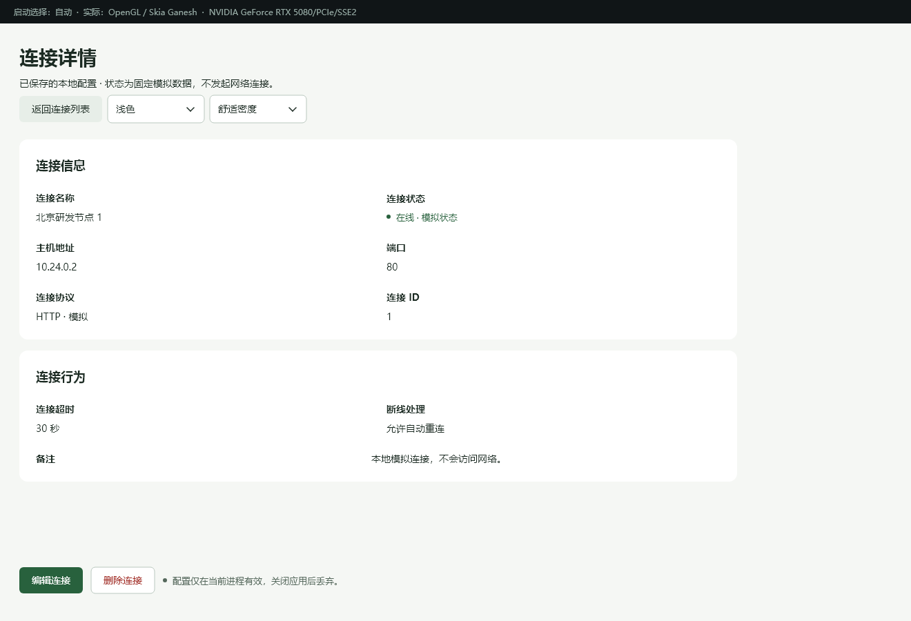
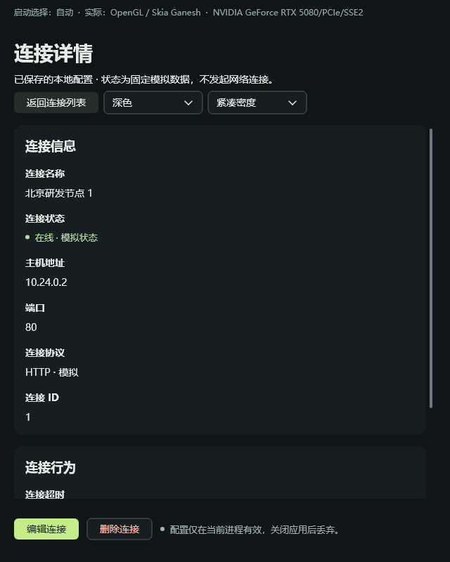
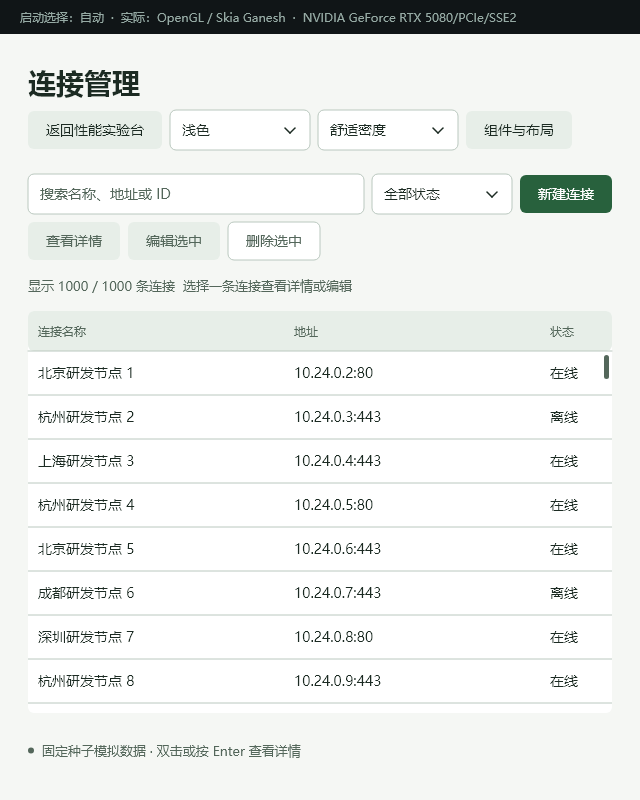
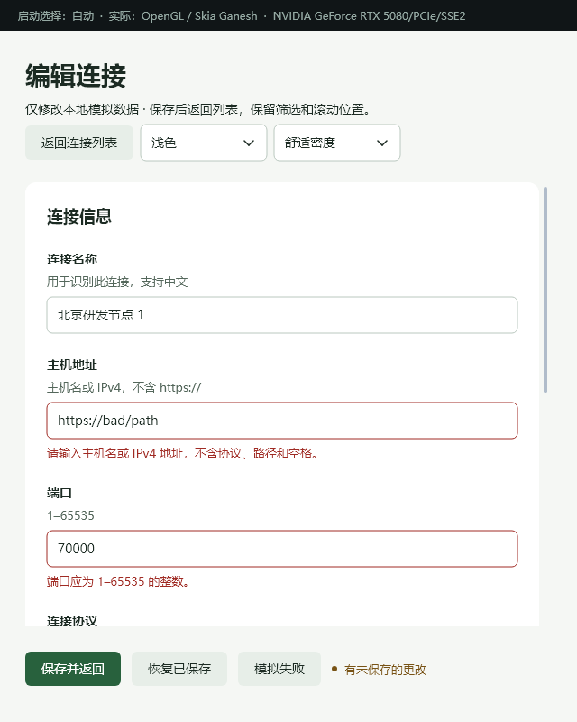

# 连接管理：列表、详情与编辑验收

日期：2026-09-28。Windows x64 / MSVC Release / OneUI + Skia Ganesh。本轮在 `71beb2e` 基础上扩展性能实验台，普通 SDK 的布局算法、主题与公共 API 未修改。

## 已交付

- C++ 和 `.one` 两种入口共享 ViewModel 的列表 → 详情 → 编辑流程。
- 双击／Enter 查看详情，也可直接编辑；按进入来源返回详情或列表，保存成功刷新相同业务 ID 的详情。
- 搜索与筛选保留；改名离开当前筛选后，详情仍可查看，返回列表显示无匹配状态。删除后选择有效相邻记录。
- 未保存确认、保存中、失败重试、取消删除沿用同一状态机制；空列表提供新建入口。
- 详情使用现有 `DetailPage / FormGrid / FormRow / Text / ActionBar`，没有新增专用 CSS 或手工字段坐标。
- 独立 [details.cpp](../examples/declarative/details.cpp)、[从字段到页面的教程](48-connection-page-recipes.md)、CMake 目标 `oneui-details` 和原生截图脚本。

## 程序化验证

| 项目 | 实际结果 |
|---|---|
| C++ / 模板流程 | 各 300 次列表 → 详情 → 编辑 → 放弃 → 详情 → 列表；207 控件、71 Mount 订阅、204 样式节点保持不变 |
| 业务返回 | 详情保存刷新、取消草稿、失败重试、删除取消／确认、记录离开筛选后继续显示详情通过 |
| 原有保存与生命周期 | 提交快照、保存后继续输入、关闭保护、后台邮箱关闭回归通过 |
| 两种入口一致性 | 2 主题 × 2 密度 × 3 宽度（1320／640／426）× 7 页面状态，共 84 组文字／矩形绘制指令一致，无布局诊断问题 |
| 长中文 | 64 字名称、200 字备注参与上述详情与确认状态矩阵 |
| 热更新 | 外部 CSS 错误回滚／删除、50 次替换、200ms 防抖、输入光标／组合状态保留，Editor 与 Details 作用域隔离通过 |
| 原有组件与渲染 | Gallery 36 场景；软件后端诊断；160 几何／回退与 54 raster 像素一致性；软件与 GPU 初始化失败各 30 次窗口生命周期回归通过 |
| 最小 C++ 程序 | `oneui-details` 编译、启动为可响应原生窗口、正常关闭，退出码 0 |
| 原生详情空闲 | 代码／模板各 1、1.25、1.5 内容缩放，6 次独立进程，各空闲 5 秒均 `paint_count=0` |

原始摘要与空闲记录见 [验证数据](benchmarks/connections-20260928/validation.txt) 及同目录文件。Mount 数量不包含整个进程的所有订阅；额外的详情页有固定控件／绑定成本。本轮验证的是反复导航不持续增长、空闲无持续绘制，不是新一轮 GPU 性能提升或 GPUI 对照。

空闲日志中的 `dpi_scale` 包含应用内容缩放，不能当作 Windows 显示设置已切到对应百分比。原有遥测字段 `cpu_percent` 在此空闲探针中不构成独立 CPU 基准，本报告不据其作 CPU 使用率结论。

## 原生客户端截图

以下来自当前构建的原生客户端捕获，不是设计稿；四张布局报告均为 `No layout issues.`。

浅色宽屏详情，C++ 入口：



深色紧凑窄窗口详情，模板入口。正文独立滚动，操作栏固定在底部：



640px 列表的工具栏自动换行：



640px 编辑页的字段校验与底部反馈：



独立视觉复核结论为 `ship`，范围仅为上述四张截图与抽查的流程源码；[设计一致性记录](connection-design-review.md)。空状态由流程与绘制测试覆盖，本轮未单独截图复核空状态。

## 尚未完成的真实桌面验收

原生桌面自动化工具两次初始化均失败：`failed to write kernel assets: 系统找不到指定的路径。 (os error 3)`。本轮没有通过它操作真实键盘、输入法候选窗口或系统显示设置，也没有把程序化输入测试当成这些检查。

| 检查 | 当前状态 | 后续可复现步骤 |
|---|---|---|
| Windows 系统 125%／150% DPI | 待验收 | 在显示设置切换比例，以默认 `--scale 1` 启动连接页；检查文字、点击命中、弹出选择框与正文滚动 |
| 不同 DPI 显示器之间拖动 | 待验收 | 将正在编辑的窗口在两块不同缩放显示器之间来回拖动，确认布局、焦点、光标与选择保留 |
| 中文输入法候选窗口 | 待验收 | 在名称字段输入拼音但暂不提交，检查候选框跟随光标；提交中文，再试取消组合输入、Tab、选择文字和 CSS 热更新 |
| 实际键盘全流程 | 本轮未新增人工／注入验收 | 从列表用方向键、Enter 进入详情，Tab 到编辑，Esc 返回；有修改时确认，Ctrl+S 保存后回原详情 |

因此本轮可以交付布局与流程实现，但不能宣称真实系统 DPI／跨屏／IME 全部验收完成。无需修改系统缩放即可先体验新页面。

## 复现

```powershell
.\examples\performance_lab\build.ps1 -Test
.\examples\performance_lab\capture-connections.ps1
.\examples\declarative\build.ps1
.\examples\declarative\build\bin\oneui-details.exe

# 关闭示例后，用独立进程验证详情页空闲；--scale 是内部缩放。
.\examples\performance_lab\build-current\bin\oneui-performance-lab.exe --view details --entry template --scale 1 --editor-idle-seconds 5 --output "$PWD/examples/performance_lab/results/detail-idle"
```
