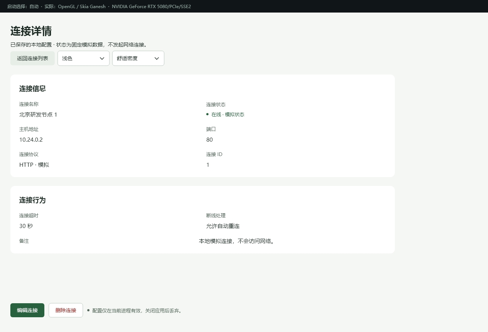
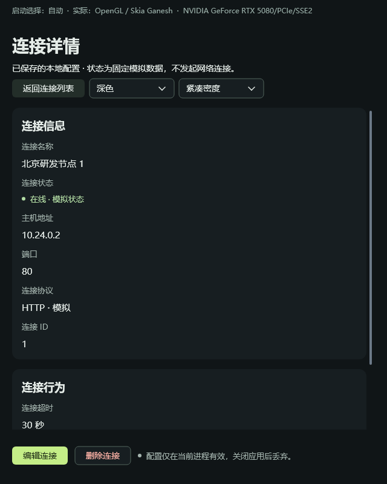
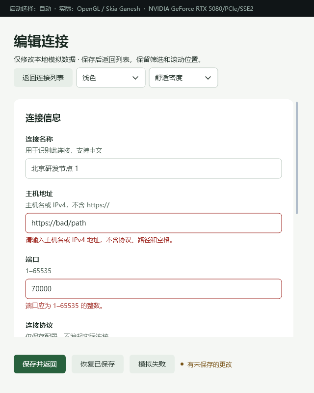

# 更短的 C++ 写法与更清晰的默认布局

这一版可以直接写 `ui.field(L"名称", ui.input(vm.name))`。标签、输入绑定、默认间距和窄窗口排列由公共组件处理；不需要为每个字段写 `make/set/model`。现有 `Mount` API 和 `.one` 模板仍可使用。

性能实验台的连接列表、详情、编辑页已迁移到这套写法。业务 ViewModel、模板及原生控件树不变；本轮不涉及粒子渲染优化。

## 先运行一个小程序

先按 [README](../README.md#运行-demowindows) 准备依赖，在仓库根目录执行：

```powershell
.\examples\declarative\build.ps1 -Test
.\examples\declarative\build\bin\oneui-hello.exe
.\examples\declarative\build\bin\oneui-details.exe
```

[hello.cpp](../examples/declarative/hello.cpp) 是完整的输入与实时预览；[details.cpp](../examples/declarative/details.cpp) 展示自动分栏、长中文、固定底部操作和主题切换。两者只引用公共 SDK。

```cpp
#include <oneui/ui_compose.h>

// app 是 DeclarativeApp；name 是持续存活的 State<std::wstring>。
oneui::ui::Compose ui(app.mount());
auto page = ui.settingsPage({
    ui.section({ui.formGrid({
        ui.field(L"名称", ui.input(name)).hint(L"支持中文"),
        ui.field(L"主机", ui.input(host)).error(hostError)
    })}).title(L"连接信息"),
    ui.actions({ui.button(L"保存", save).primary(), ui.status(message)})
}).title(L"连接设置");
oneui::ui::applyTheme(app.mount());
return app.run(page);
```

上面的 `host`、`message` 是 `State<std::wstring>`，`hostError` 可以是 `Computed<std::wstring>`，`save` 是 `VmCommand`。业务逻辑仍在 C++ ViewModel 中。完整连接流程：

```powershell
.\examples\performance_lab\run.ps1 -Build -Connections -Entry code -Dev
# 关闭上一窗口后，对比同一 ViewModel 的模板版。
.\examples\performance_lab\run.ps1 -Connections -Entry template -Dev
```

## 常用写法

| 意图 | C++ 写法 | 对应模板 |
|---|---|---|
| 固定文字 | `ui.text(L"说明")` | `<Text text="说明" />` |
| 随状态更新的文字 | `ui.text(vm.name)` | `<Text :text="name" />` |
| 双向输入 | `ui.input(vm.name)` | `<Input v-model="name" />` |
| 带说明、校验的字段 | `ui.field(L"名称", ui.input(vm.name)).hint(L"支持中文").error(vm.nameError)` | `FormRow` 的 label/hint/:error |
| 开关 | `ui.toggle(vm.enabled)` | `<Switch v-model="enabled" />` |
| 下拉选项 | `ui.select(vm.options, vm.index)` | `<Select :items="options" v-model="index" />` |
| 命令与主要操作 | `ui.button(L"保存", vm.save).primary()` | `<Button variant="primary" @click="save">保存</Button>` |
| 条件显示 | `part.visible(vm.show)` | `v-if="show"` 保留控件的显示切换 |
| 原生虚拟表格 | `ui.table(vm.columns, vm.rows, vm.selectedKey)` | DataTable 的 :columns/:items/v-model |
| 表格激活／删除 | `.onActivate(vm.open).onDelete(vm.remove)` | @activate / @delete |
| 诊断与样式 | `.ref("name").classes("muted").located(__FILE__, __LINE__)` | ref / class / 模板源位置 |

`ui.formGrid({ ... })` 接受 `ui.field(...)`，按可用宽度自动分栏；`.minColumnWidth(320)` 设置列基准。正文用 `settingsPage/listPage/detailPage`，底部操作用 `actions`，搜索工具条用 `toolbar`。无需手动计算字段坐标。复杂布局仍可取 `.element()` 或与旧 `Mount` API 混用。

组件名称、合法属性、属性值类型和 model 类型由 [ui_component_schema.h](../include/oneui/ui_component_schema.h) 定义；模板编译器与 [ui_compose.h](../include/oneui/ui_compose.h) 共同使用。输入绑定 `State<bool>`、给 Text 写 `.error(...)`、给普通文字写 `.primary()`、向 FormGrid 放普通 Text 等错误，在 C++ 编译时被拒绝。

这一层有明确边界：

- `Compose` 与 `Part` 是创建页面时使用的轻量句柄，不是第二套响应式或渲染系统。所有操作交给原有 Mount；不按帧重建控件。
- Mount 和绑定的 State/Computed/ViewModel 必须在句柄使用期间存活。临时 State/Computed 不可作为绑定源；页面生命周期和异步回投仍遵循原 Mount 约定。
- 常用属性有类型检查，但不是完整静态布局检查器。容器仍可接收 Element；重复 ref、无效尺寸、多个固定操作区等部分结构问题仍由运行期诊断。
- IDE 可能列出某组件不支持的通用方法，调用时才给出静态断言。低频属性可继续使用 Mount，不承诺本版封装全部旧接口。
- `.located` 在 C++17 中显式标注位置；`.one` 的源位置继续由编译器自动生成。结构／业务代码变化需要重建，CSS 仍支持 200ms 防抖热更新。

## 默认外观改了什么

| 层级 | 舒适密度 | 紧凑密度 |
|---|---:|---:|
| 页面内的分组之间 | 24px | 16px |
| 分组内的字段之间 | 20px | 12px |
| 网格字段的标签与控件 | 8px | 8px |
| 说明、校验等文字内部 | 4px | 4px |

只读字段标签使用较淡的 13px 常规文字，值使用 15px 中等字重；编辑字段继续保留明确的标签和焦点样式。调的是公共声明式主题，已有传统原生控件的默认主题保持原行为。绿色强调色、浅深主题、控件高度及表格行高未改变。

修改前（`219b76e`）：


修改后：



窄窗口、深色和校验反馈使用同一套组件：




更多原生截图：[浅色编辑页](images/typed-authoring/editor-light-wide.png)、[窄窗口列表](images/typed-authoring/list-light-narrow.png)、[加载／空／错误状态](images/typed-authoring/states-dark-narrow.png)。

## 代码量与实测

对比基线 `219b76e` 与本轮的三个完整函数（含原有辅助 lambda）：`buildPage`、`buildDetails`、`buildWorkspace`。统计 Unicode 字符并排除空白，避免旧版一行写多条语句造成行数误导。

| 页面创建函数 | 原写法 | 新写法 |
|---|---:|---:|
| 编辑页 | 2,528 | 1,360 |
| 详情页 | 1,871 | 1,132 |
| 工作区与列表 | 3,480 | 2,351 |
| 合计 | 7,879 | 4,843 |

相同功能的页面创建代码减少 **38.5%**。不含公共封装代码，也不代表实际开发时间缩短同样比例；ViewModel 和业务逻辑没有计入。

2026-09-28，同一台 Windows 10、Ryzen 9 9950X3D（32 逻辑处理器）、RTX 5080；MSVC Release、实际 OpenGL + Skia Ganesh。1320×900 客户区、1,000 条固定数据，开发监听关闭。每个版本分别交替测代码／模板三轮，每轮 50 次预热、50 次计量；负载为筛选、编辑、未保存确认和放弃修改。

| 三轮平均 | 修改前 C++ | 新 C++ | 新模板 |
|---|---:|---:|---:|
| CPU，占整机比例 | 3.164% | 3.186% | 3.186% |
| CPU 侧 paint 平均 | 3.372 ms | 3.260 ms | 3.263 ms |
| 每轮 paint P95 的平均 | 6.821 ms | 6.540 ms | 6.554 ms |
| 工作集 | 101.00 MiB | 100.28 MiB | 99.60 MiB |
| 私有提交内存 | 143.66 MiB | 142.75 MiB | 142.44 MiB |
| 稳定后 5 秒额外 paint | 0 | 0 | 0 |

未观察到明显的运行期开销回归。修改前后同时包含视觉调整，且只有三轮样本，不能把小幅下降归因于封装优化。新版代码／模板平均 paint 相差约 0.004ms；这不足以证明一方更快。paint 是 CPU 侧绘制工作，不是 GPU 时间或显示帧率，不是 GPUI 对比。

另测当前同一二进制内完整 ViewModel、Mount、控件构建、主题应用和首次属性提交；2 轮预热后交替取 10 轮，排除绘制、窗口启动和析构：

| 构建耗时 | C++ | 模板 |
|---|---:|---:|
| 中位数 | 10.824 ms | 11.613 ms |
| 平均数 | 10.850 ms | 14.060 ms |
| 最小～最大 | 10.674～11.015 ms | 11.372～22.792 ms |

模板存在两次约 22ms 的长样本，原样保留；该短测试不用于推断长期启动表现。代码版与模板版都生成 **207 个控件、71 个 Mount 订阅、204 个样式节点**，没有新增常驻控件或订阅。

[原始数据及汇总](benchmarks/typed-authoring-20260928/summary.json)包含前后两次测试的 CSV、后端记录、exe/DLL 哈希和构建计时，全部样本保留。复现：

```powershell
.\examples\performance_lab\build.ps1 -Test
.\examples\performance_lab\compare-entries.ps1 -Rounds 3 -Cycles 100
.\examples\performance_lab\build-current\bin\oneui-authoring-tests.exe --construction-benchmark
```

先关闭其他实验台窗口，测量期间不要构建。前后版本分别构建后再测；同一轮的 code/template 使用相同 exe/DLL。

## 验证与剩余边界

- 本轮干净提交范围内的 SDK／声明式 CTest 14/14 通过，包含原模板正反例及新增 C++ 2 个正例、8 个错误用法。
- 同一 ViewModel 两种入口的 84 组页面／主题／密度／宽度绘制结果一致，Gallery 36 场景通过。
- 两种入口各 300 次列表／详情／编辑循环，控件、订阅、样式节点数量稳定。
- CSS 错误回滚、删除规则、作用域隔离、50 次连续热更新与防抖通过。
- 新 API 验证输入焦点、光标、组合输入状态、程序化标签／错误说明，以及 Mount 销毁后的命令回调失效。
- 原粒子几何／光栅一致性、CPU 与强制 GPU 失败后的窗口生命周期回归通过；本轮未改变粒子实现。
- 六张真实原生客户端截图已检查；独立视觉审查结论为 **ship**，范围见 [设计审查记录](typed-authoring-design-review.md)。

真实 Windows 125%／150% DPI、跨显示器迁移及中文输入法候选窗口仍未完成人工验收。程序内部缩放、组合输入状态测试和截图不能替代这些系统级检查。当前性能数据只覆盖所列机器、后端和负载，不能概括低配设备或所有页面。

主工作区集成结果：性能实验台全部回归通过；SDK CTest 为 13/14，唯一失败是此前未提交的 `tests/win32_accessibility_tests.cpp` 中新增的 `terminal-mac` 标题栏尺寸断言（`Mac caption keeps same identity with left geometry`），单独复跑仍失败。该目标的依赖中不包含本轮修改的声明式头文件，本轮没有修改该测试或标题栏实现。原有 47 个已跟踪修改及 14 个未跟踪文件按字节校验保留，没有纳入本次提交；此项主工作区失败另行处理，不记作本轮通过。
