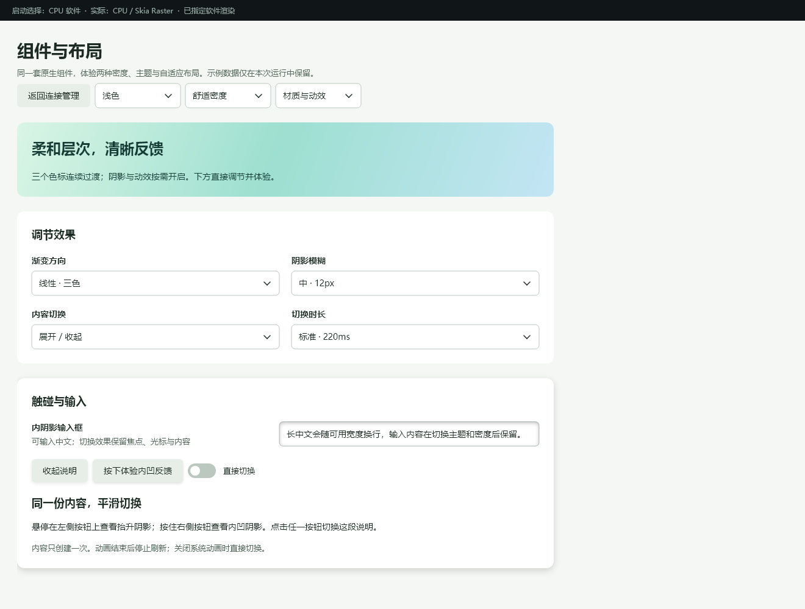
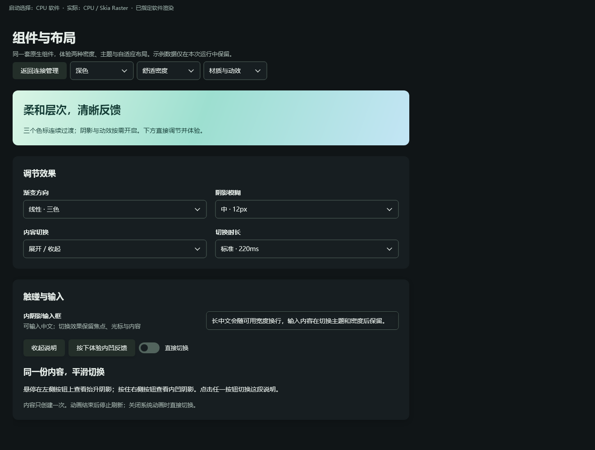

# 阴影、渐变与状态动效

OneUI 现在可以直接为原生容器、按钮和输入框设置柔和的外阴影、真实内阴影及多色标渐变。展开、淡入和按钮反馈也有现成入口，不需要在应用里写逐帧计时器或重建页面。

默认表单继续保持简洁：**效果按需开启**。建议先用 `Section`、`FormGrid` 和统一主题完成层级，再为需要强调的区域添加少量效果。

## 先运行体验

从仓库根目录运行；首次准备环境见[README](../README.md#运行-demowindows)。

```powershell
.\examples\performance_lab\run.ps1 -Build -Effects
# 关闭上一窗口后，分别体验软件和 GPU 绘制
.\examples\performance_lab\run.ps1 -Effects -Renderer cpu
.\examples\performance_lab\run.ps1 -Effects -Renderer gpu
# 修改 Gallery.one 的 style 块或 connections.css 后即时预览
.\examples\performance_lab\run.ps1 -Effects -Dev
```

“材质与动效”是组件展示的第四个场景，也可从 `-Components` 页头选择。可以切换浅／深主题和密度，选择线性／径向三色渐变、6／12／20px 外阴影模糊、展开／淡入以及120／220／400ms 时长。输入框内阴影使用外阴影模糊的一半。悬停左侧按钮体验阴影抬升，按住右侧按钮体验内凹；点击任一按钮切换说明。“直接切换”关闭内容过渡。





这些是原生客户端捕获；静态图片不展示动画，也不能代替实际 GPU 像素或系统 DPI 验收。示例布局和样式在 [Gallery.one](../examples/performance_lab/views/Gallery.one)，可调参数在 [component_gallery.hpp](../examples/performance_lab/component_gallery.hpp)。

## 加一行样式，使用现成反馈

应用共享主题后，给按钮加 `motion-lift` 或 `motion-press` 类：

```cpp
ui.button(L"展开说明", toggle).classes("motion-lift");
ui.button(L"执行操作", execute).classes("motion-press");
```

模板写法相同：

```html
<Button class="motion-lift" @click="toggle">展开说明</Button>
<Button class="motion-press" @click="execute">执行操作</Button>
```

`toggle`、`execute` 是 C++ `ui::VmCommand`。`motion-lift` 在悬停时增加阴影高度和模糊度，控件本身不移动，命中区域保持稳定；`motion-press` 在按下时切换为内阴影。时长分别为140ms和110ms，禁用时去掉阴影。它们不会自动触发业务操作或循环播放。

## 展开、淡入：保留原来的输入控件

下面是可放进 `.cpp` 的完整示例；CMake 引用方式沿用[入门示例](../examples/declarative/README.md)。

```cpp
#include <oneui/ui_declarative_app.h>
#include <oneui/ui_compose.h>
#include <oneui/ui_theme.h>

int main() {
    oneui::ui::DeclarativeApp app(L"状态动效", 760, 540);
    oneui::State<bool> open{true};
    oneui::State<std::wstring> note{L"收起后再展开，内容仍然保留"};
    oneui::ui::VmCommand toggle;
    toggle.setAction([&] { open.set(!open.get()); });
    oneui::ui::Compose ui(app.mount());
    auto page = ui.settingsPage({
        ui.button(L"展开 / 收起", toggle).classes("motion-lift"),
        ui.reveal(ui.field(L"备注", ui.input(note)))
            .open(open).preset(L"expand")
    }).title(L"高级设置");
    oneui::ui::applyTheme(app.mount());
    return app.run(page);
}
```

`.one` 中绑定 ViewModel 的同名成员：

```html
<SettingsPage title="高级设置">
  <Button class="motion-lift" @click="toggle">展开 / 收起</Button>
  <Reveal :open="open" preset="expand">
    <FormRow label="备注"><Input v-model="note" /></FormRow>
  </Reveal>
</SettingsPage>
```

| 配置 | 行为 |
|---|---|
| `open` / `.open(...)` | `bool` 或 `State<bool>`；控制显示与收起 |
| `preset="expand"` / `.preset(L"expand")` | 默认；高度随进度变化，由现有 Yoga 布局安排相邻内容 |
| `preset="fade"` | 内容整体透明度变化；淡出结束前保持原占位，结束后移除占位 |
| `reduced-motion="true"` / `.reducedMotion(true)` | 直接到达最终状态，不播放该 Reveal 的过渡 |
| `transition-duration` | CSS 毫秒时长，默认220ms；收起使用该值的75% |
| `transition-timing-function` | CSS 缓动，默认 `ease-out` |

`Reveal` 必须有且仅有一个直接子组件；有多项时用 `Column` 包起来。使用 `open` 控制过渡，不要同时用 `v-if` 移除这个 Reveal。子控件创建一次，收起不会清空 ViewModel、输入内容或重新建立绑定。开始收起或正在展开期间，内容暂不接受点击和焦点，避免操作尚未完整显示的区域；若内部原先有焦点，会主动清除，展开后不会强行抢回。完全展开后不裁剪子控件弹层，下拉菜单恢复原有绘制和命中范围。这与修改外部样式时保留焦点是两个不同场景。

```css
Reveal.details { transition-duration: 220ms; transition-timing-function: ease-out; }
```

窗口使用现有动画调度，仅过渡期间请求更新。反复切换会从当前进度转向新目标。没有调度器、设置0ms、关闭应用动效或 Windows 关闭客户端区域动画时，直接切换到最终状态。

## 自定义阴影和渐变

把下面内容放进 `.one` 的 `<style scoped>`；为相应 `Section` 或 `Input` 添加同名 `class`。

```css
Section.feature {
  background: linear-gradient(110deg, #d9f5e5 0%, #9ddfd0 48%, #c3e5f5 100%);
  border-radius: 12px;
  box-shadow: 0px 4px 12px #00000026;
}
Input.recessed {
  box-shadow: inset 0px 2px 6px #00000040;
}
Section.spotlight {
  background: radial-gradient(80% at 25% 30%, #e8f7cf 0%, #9ddfd0 48%, #c3e5f5 100%);
}
```

渐变上方文字需要明确可读的前景色。示例的浅色渐变在两种主题中都配深色文字；直接套用深色主题默认浅色字可能导致对比度不足。

### 当前语法

- `box-shadow: [inset] 横向偏移px 纵向偏移px 模糊px [扩展px] 颜色`。可用逗号设置最多8层，或 `none` 清除旧阴影。模糊须为非负有限数；长度显式写 `px`，包括 `0px`。内阴影会模糊并裁剪在圆角内部，不再用描边近似。
- `linear-gradient([角度deg,] 颜色 [位置%], ...)`，省略角度为180deg。角度采用 CSS 方向：0deg朝上，90deg朝右。不支持 `to right` 等方向关键字。
- `radial-gradient([半径%] [at 横向% 纵向%], 颜色 [位置%], ...)`。这是 OneUI 的圆形径向渐变子集，不支持浏览器的椭圆和 `closest-side` 等尺寸关键字。
- 每个渐变2至32个色标。位置在0%至100%之间并按顺序排列；同位置色标可做硬分界；省略的位置会自动分配。不是只取头尾两种颜色。
- 渐变写在 `background`，不要写成 `background-color`。纯色背景和渐变互相替换，删除规则或 `box-shadow:none` 也会移除旧效果。

| 组件／入口 | 本轮支持 |
|---|---|
| Stack 类语义容器，如 `Section`、`Column`、`Toolbar`，以及 `Scroll` | 静态背景渐变、内／外阴影和圆角裁剪 |
| `Button`、`Input`、`SearchInput` | 渐变和阴影；按钮、输入的状态阴影可过渡 |
| `Reveal` | fade／expand；CSS 时长和缓动。背景、阴影请加在其子容器上 |
| `Select`、`Switch`、`DataTable` | 本轮没有为严格声明式入口扩展渐变和阴影 |
| 低层 C++ Canvas | `fillGradient`、`drawInsetShadow`、`saveOpacity`，见下文 |

严格 CSS 会对组件不支持的属性、错误渐变和阴影语法报告诊断。它仍是原生组件使用的 CSS 子集，**不包含任意属性动画、CSS keyframes、transform、滤镜、背景图片或完整浏览器布局**。渐变在状态切换时即时替换，本轮没有实现色标间动画。容器阴影也不会因为设置按钮动效类而自动动画。

C++ 页面和模板共用 Mount、组件元数据、StyleSheet 及原生控件；C++ 可通过 `mount.styles()->replace(...)` 应用 CSS 字符串。替换时需包含 `ui::declarativeTheme(...)` 和自己的规则，以免覆盖共享主题。开发模式的监听、防抖和错误回退由示例样式会话提供，普通 Canvas 调用本身不启动文件监听。

## 自定义 Canvas 与减少动画

`Gradient` 包含有序 `GradientStop { color, position }`（位置0到1），以及线性角度或径向中心／半径。`Canvas::fillGradient(rect, gradient, radius)` 负责绘制；`drawInsetShadow` 接受已有 `BoxShadow`；`saveOpacity(bounds, opacity)` 必须与 `restore()` 成对使用。

仓库的 **Skia 软件与 GPU 路径均实现真实内阴影、多色标渐变和内容透明度层**。这些新增虚函数给自定义 Canvas 留有默认实现以便源代码继续编译：渐变退化为头尾两色，内阴影不绘制，`saveOpacity` 只保存画布状态而不降低透明度。自定义后端需要覆盖它们才能得到完整效果，不能把默认回退当作相同画质承诺。新增 C++ 虚函数后，应用和 DLL 需一同重新构建。

在 UI 线程调用 `oneui::setMotionEnabled(false)` 可关闭应用的 FloatTransition／ColorTransition 过渡；Windows 客户端区域动画偏好还会进一步限制它们。Reveal 的 `reduced-motion` 是局部开关。这里不改变 `SmoothScrollMotion`，也不替应用停止自定义粒子／图表循环，所以不是“所有动画的全局开关”。

## 性能与验收

先关闭其他实验台窗口，用相同二进制交替测量：

```powershell
.\examples\performance_lab\compare-effects.ps1 -Rounds 3 -Seconds 5
```

脚本记录环境、exe/DLL哈希、原始轮次和 `summary.csv`：每轮预热3秒，分别测活动效果和同页空闲（先交互2.1秒，再静置至第3秒开始采样）；CPU／GPU优先顺序交替。活动负载每500ms切换内容，每4秒切换展开／淡入，并触发原生按钮悬停；没有每帧重建控件或解析 CSS。它检查实际后端，拒绝 GPU 回退和空闲额外绘制样本。

CPU百分比按整机逻辑处理器归一化。paint／submit／blit是 CPU 侧计时，不是 GPU 时间戳或屏幕帧率。阴影模糊、透明度层和展开布局仍然有实际绘制成本，不承诺开启效果与关闭效果一样快。

效果场景统一使用 `Gallery.one`；脚本的 `-Entry` 只影响共享的连接业务入口，**此脚本不能作为效果页 C++ 对模板的性能对照**。此前连接页的代码／模板对比应查看[原有报告](50-typed-authoring-and-defaults.md)。

核心回归入口为实验台的 `oneui-effects-tests` 和 Gallery 布局测试，覆盖渐变／阴影解析、Reveal 状态与焦点、绑定保留、重复切换和 scoped CSS。真实绘制、性能结果及系统环境限制应和对应原始记录一起解读。窄窗口与内容缩放截图不等同物理显示器125%／150% DPI、跨屏或真实中文输入法候选窗口验收。

### 本机实测（2026-09-28）

Windows 10 22H2、Ryzen 9 9950X3D（32逻辑处理器）、RTX 5080，Release、1320×1000、内容缩放100%、浅色舒适密度。三轮交替运行，各3秒预热、5秒采样；下面是三轮中位数。

| 场景 / 后端 | 平均 paint | 内容绘制 P95 | 进程 CPU | 工作集 | 私有内存 | 采样绘制次数 |
|---|---:|---:|---:|---:|---:|---:|
| 连续交互 / 软件 | 4.16ms | 14.10ms | 0.858% | 118.01MiB | 97.16MiB | 312 |
| 连续交互 / GPU | 1.11ms | 12.96ms | 0.371% | 172.14MiB | 307.88MiB | 337 |
| 交互后空闲 / 软件 | — | — | 0% | 99.23MiB | 78.35MiB | 0 |
| 交互后空闲 / GPU | — | — | 0% | 148.48MiB | 257.39MiB | 0 |

这个场景的 GPU 平均 paint 比软件低约73%，但内存更高；不是“效果没有成本”。P95显示仍有布局切换峰值，不能用平均值承诺每帧1ms。CPU百分比是32逻辑处理器归一化，0%仅表示这个短采样的计数器未记录到CPU时间。空闲行先执行展开／收起，待动画结束后采样；三轮两种后端均为0次绘制，缓存仍可驻留。活动采样包含最多60次/秒的诊断投递，paint次数不是显示FPS。

[环境与二进制哈希](benchmarks/effects-20260928/environment.json)、[12轮原始汇总](benchmarks/effects-20260928/summary.csv)、[中位数](benchmarks/effects-20260928/medians.json)以及每轮 `content-paint.csv` / `renderer-performance.txt` 均保留。测试使用隔离工作树中的同一exe/DLL；后续合入原工作区时保留的其他未提交功能不计入这组基准。测量后仅追加CSS变量诊断检查，不改变绘制路径。

### 已执行的验证与边界

- 实验台整套回归通过：48组Gallery布局、84组代码／模板页面对照、300次业务循环，以及既有粒子和窗口生命周期回归。
- 新效果测试通过：颜色位置／硬分界／错误语法、CSS替换失败回退／删除、焦点与中文组合文本保留、1000次中断切换、闭合时父容器Tab路由、完整展开的Select弹层、减少动效，以及祖孙容器阴影脏区。
- 编译器正反例通过，包括Reveal的单子组件约束、静态参数、C++／模板绑定类型错误和 `.one` 源行定位。
- Skia软件PNG和实际OpenGL前缓冲在100%／125%／150%内容缩放各检查9个材质采样点；最大RGB通道差分别4、1、2（阈值8）。检查了中间色标、径向中心、圆角、内／外阴影衰减、半透明层和硬分界。这是选点检查，**不是整幅图逐像素相等**。
- 原生客户端浅／深、宽／窄及内容缩放截图已生成；真实系统DPI切换、跨显示器、屏幕阅读器和系统IME候选窗未作完整人工验收。
- 收尾后隔离工作树 SDK 回归 35/35 通过。交互测试改为检查运行时 ABI 与当前头文件一致，替换过时的 ABI33 硬编码断言。

复现材质像素检查（Python需Pillow）：

```powershell
.\examples\performance_lab\build-current\bin\oneui-effects-tests.exe --cpu .\effects-output
.\examples\performance_lab\build-current\bin\oneui-effects-tests.exe --gpu .\effects-output
python .\examples\performance_lab\check-effect-pixels.py .\effects-output
.\examples\performance_lab\capture-effects.ps1
```

原工作区合入后已再次执行实验台 `build.ps1 -Test`，整套通过；其CPU／GPU原生材质选点检查也通过。原有未提交功能经三方合并保留，未混入隔离基准的统计。

收尾修正：交互测试已改为检查运行时ABI与当前头文件一致，避免后续版本递增导致硬编码断言失败。

后续更新：[页面组合与阴影缓存优化](52-layout-recipes-and-presets.md) 用同一二进制对照定位并减少展开时的外阴影峰值；本页保留优化前基准。收尾后 SDK 全部 35 项测试通过。

后续修复：[展开／收起连续性与自动检测](53-motion-continuity-and-diagnostics.md)处理启动进度、父级间距跳变和软件阴影慢帧，并提供逐帧自动回归。
