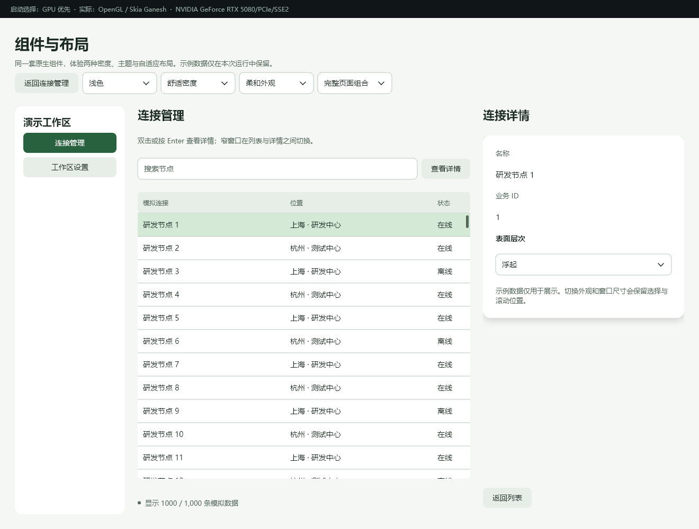
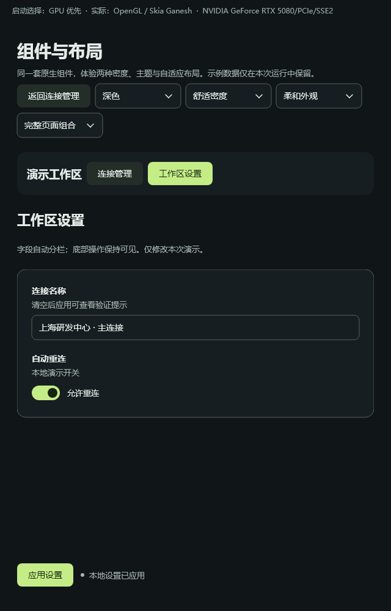

# 完整页面组合与视觉预设

后续更新：[动效连续性与自动检测](53-motion-continuity-and-diagnostics.md)已修复间距／起始进度跳变，并优化软件阴影。本页性能数据保留为上一阶段基准。

这一步把常见的页面结构交给框架：**导航放哪里、列表和详情怎么并排、窄窗口怎么切换、表单底部操作怎么保持可见**。应用仍然只描述内容和状态，不写 `setFrame`。

## 先运行

在仓库根目录执行（首次准备 Skia 见 README）：

```powershell
.\examples\performance_lab\run.ps1 -Build -Layouts -Entry code
.\examples\performance_lab\run.ps1 -Layouts -Entry template
```

顶部可切换浅／深主题、舒适／紧凑密度和标准／柔和外观。侧栏进入连接列表或工作区设置；列表支持搜索、选择和双击／Enter 打开详情。设置仅保存在本次演示内，清空名称后点击应用可看验证提示。不是持久化配置服务。





## C++ 写法

下面片段放在已有 `Mount` 和长寿命 ViewModel 的页面构建函数中；`list`、`detail`、`settings` 都是保留的原生控件：

```cpp
oneui::ui::Compose ui(mount);
auto list = ui.listPage({
    ui.toolbar({ui.search(vm.query).name(L"搜索连接")}),
    ui.table(vm.columns, vm.rows, vm.selected).onActivate(vm.openDetail)
}).title(L"连接管理");
auto detail = ui.detailPage({
    ui.surface({ui.field(L"名称", ui.text(vm.selectedName))})
        .appearance(L"raised"),
    ui.actions({ui.button(L"返回列表", vm.closeDetail)})
}).title(L"连接详情");
auto page = ui.sidebarLayout(
    ui.sidebar({ui.button(L"连接管理", vm.showConnections)}),
    ui.masterDetail(list, detail).detailOpen(vm.detailOpen)
);
oneui::ui::applyTheme(mount, false,
    oneui::ui::Density::Comfortable, oneui::ui::VisualPreset::Soft);
```

完整可构建版本：[recipe_code.hpp](../examples/performance_lab/recipe_code.hpp)。与模板共用的状态和命令在 [Samples](../examples/performance_lab/component_gallery.hpp)。`openDetail` 设置 `detailOpen=true`，返回命令设置为 `false`；名称等派生逻辑仍放在 C++。

## 模板写法

```xml
<SidebarLayout>
  <Sidebar><Button @click="showConnections">连接管理</Button></Sidebar>
  <MasterDetail :detail-open="detailOpen">
    <ListPage title="连接管理">
      <DataTable :columns="columns" :items="rows"
                 v-model="selected" item-key="id" @activate="openDetail" />
    </ListPage>
    <DetailPage title="连接详情">
      <Surface appearance="raised"><Text :text="selectedName" /></Surface>
      <ActionBar><Button @click="closeDetail">返回列表</Button></ActionBar>
    </DetailPage>
  </MasterDetail>
</SidebarLayout>
```

完整版本：[Recipes.one](../examples/performance_lab/views/Recipes.one)。两种入口用同一套组件适配、Yoga、原生表格和绑定机制。打开组合场景时构建一次，之后导航、主题和断点切换只改已有控件。

## 组件怎么选

| 组件 | 做什么 | 约束／默认值 |
|---|---|---|
| `SidebarLayout` / `ui.sidebarLayout` | 导航＋主内容；窄时导航放上方并换行 | 两个子组件，第一个必须是 `Sidebar`；断点 960 逻辑像素，侧栏请求宽 208 |
| `MasterDetail` / `ui.masterDetail` | 宽时列表＋详情，窄时单页 | 两个子组件；断点 800，详情请求宽 380；`detail-open` 控制窄窗口显示哪页 |
| `SettingsPage` ＋ `ActionBar` | 限宽表单＋固定底部操作 | 内容可以滚动，ActionBar 保持可见；字段用 `FormRow`／`FormGrid` |
| `Surface` / `ui.surface` | 表面层次与一致内边距 | `appearance` 为 `flat`／`outlined`／`raised`／`tinted`，可绑定字符串状态 |
| `Button.variant` | 用状态标记当前导航 | `normal`／`primary`／`danger`，更新时替换旧变体 |

断点按**容器实际宽度**判断，不按整个窗口。`.breakpoint(float)`、`.paneWidth(float)` 或模板静态 `breakpoint`、`pane-width` 可调整尺寸；它们必须为正有限数。请求的固定栏宽最多占去除 padding/gap 后空间的一半，避免挤出另一栏。容器拥有两个直接子组件的可见性，请把业务条件放在子组件内部或整个容器上。

标准预设保留既有默认视觉。柔和预设使用稍大的控件／表面圆角，以及克制的 Surface 阴影；`outlined` 等显式外观覆盖预设层次。浅深色与密度仍独立切换。CSS 使用 `--control-radius`、`--surface-radius`、`--surface-shadow`、`--raised-shadow` 等语义变量，不引入第二套绘制或布局系统。动效继续用 [Reveal 与已有动效类](51-effects-and-motion.md)。

## 验证与限制

- 两种入口合计 240 组主题、密度、预设、宽度和导航状态检查（1320／960／800／640／426 逻辑宽）。布局诊断没有溢出。
- 300 次导航／详情／场景切换后控件和订阅没有增长，业务选择和有效滚动位置保留；缩放布局和换肤不打断仍可见输入框的焦点、光标、选区及组合文本。
- 窄页切换会将焦点移出隐藏子树；示例显式的查看／返回命令也会移动到目标栏首个可聚焦控件，因此宽窗口两栏同时显示时仍有实际作用。真实系统 IME 候选窗口、跨屏和物理 DPI 切换没有完整人工验收。
- 此场景是页面组合示范，不是完整应用路由器；没有 URL、历史栈、可拖动分隔栏或状态持久化。
- 截图来自原生客户端的 `captureFramePng`（软件离屏捕获）；GPU 实际提交用独立 OpenGL 前缓冲材质测试验证。

### 大表面阴影优化

性能跟踪显示，展开过程中布局平均约 0.05ms，主要峰值是高度变化使大块外阴影反复生成完整模糊位图。GPU 后端对足够大、整数尺寸的圆角外阴影，现改为缓存小块角部和边缘，再扩展平直部分；软件后端、小块、圆角过大或非整数尺寸沿用原路径。软件 lattice 采样在本场景反而更慢，因此没有启用。没有关闭阴影，也不改变内阴影实现。

复现同一二进制的原路径／优化路径对照（先关闭其他实验台）：

```powershell
.\examples\performance_lab\compare-shadows.ps1 -Rounds 3 -Seconds 5
```

仅实验台构建包含 `ONEUI_SHADOW_REFERENCE=1` 对照开关，普通 SDK 在符合条件的 GPU 后端默认自动使用优化路径。平均 paint 和内容 P95 是 CPU 侧计时，不等于显示 FPS 或 GPU 时间戳。

逐像素对照覆盖大／小／非整数圆角阴影、渐变和透明度层，在 100%／125%／150% 内容缩放下：软件全图差异为 0；OpenGL 最大通道差 0／11／10，整图平均绝对通道差 0／0.003015／0.001356。非整数缩放的 GPU lattice 边缘采样有少量差异；没有宣称 GPU 逐像素一致。检查脚本为 `check-shadow-pixels.py`，同时限制最大和平均误差。

材质对照可运行 `./examples/performance_lab/capture-shadows.ps1`（Python 需 Pillow）。性能脚本拒绝后端回退、错误场景和空闲重绘；单个空闲样本可重试一次，失败原始记录保留，汇总标记 attempt，连续失败则停止。

最终独立源码／截图复核已通过；宽窗口导航动作原先没有可见效果的问题已改为明确移动键盘焦点，并补充双入口回归断言。编译器正反例、实验台全套回归和隔离工作树 SDK 35/35 测试通过。

### 最终同机实测（2026-09-28）

Windows 10 22H2，Ryzen 9 9950X3D（32 逻辑处理器），RTX 5080。Release，同一 exe/DLL，1320×1000、100% 内容缩放、浅色舒适密度。每组预热3秒、采样5秒，三轮交替顺序，以下为中位数。这里比较的是外阴影策略；不是 C++ 与模板，也不是整个应用的通用性能承诺。

| 后端／策略 | 平均 paint | 内容 P95 | CPU（整机归一化） | 工作集 | 私有内存 |
|---|---:|---:|---:|---:|---:|
| 软件／原路径 | 4.23ms | 14.33ms | 0.859% | 117.78MiB | 97.07MiB |
| 软件／最终策略 | 4.22ms | 14.29ms | 0.898% | 117.50MiB | 96.71MiB |
| GPU／原路径 | 1.09ms | 12.81ms | 0.371% | 170.41MiB | 302.80MiB |
| GPU／最终策略 | 0.62ms | 0.95ms | 0.293% | 109.28MiB | 160.01MiB |

软件两种模式都使用原尺寸缓存，数值差异属于独立采样波动；GPU 才启用九宫格。最终纳入统计的 12 组空闲样本均为 0 次绘制。此次有 2 组首次空闲样本出现额外绘制，被拒绝并重试；失败原始记录与成功重试都保留，因此这里不声称所有启动尝试都完全没有额外绘制。没有把被拒绝记录算成 0，也没有删除它们。

[环境和二进制哈希](benchmarks/shadows-20260928/environment.json)、[24组有效样本](benchmarks/shadows-20260928/summary.csv)、[中位数](benchmarks/shadows-20260928/medians.json)与每轮原始文件均可追溯。隔离工作树测量；原工作目录的其他未提交功能未纳入基准。随后只更新文档和合入用户原有改动。

合入原工作目录后再次通过 `build.ps1 -Test` 与 CPU／GPU 阴影像素检查。主目录代码版和模板版的 1320×1000 原生客户端截图逐像素一致（同主题／密度／预设／选中节点）。原有其他未提交修改通过三方合并、逆向校验及文件哈希校验保留。
