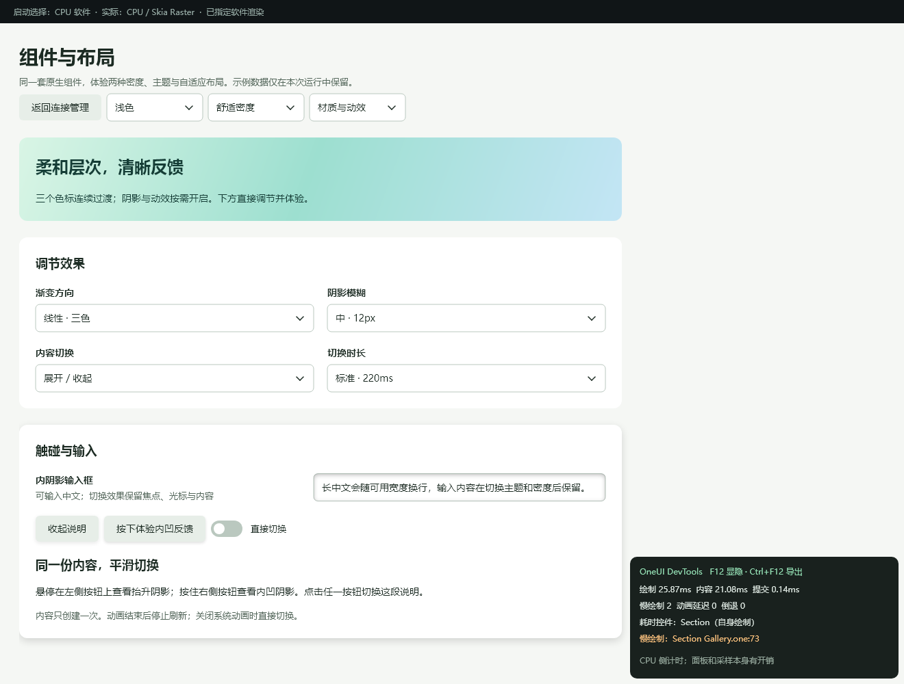

# 内置开发诊断：正常操作时发现慢帧

这项能力位于 OneUI SDK 的窗口、View 和 Reveal 中。应用无需手动计时、指定所有待测控件，也不需要启动 PowerShell 脚本。

## 一行开启

```cpp
#include <oneui/platform/window.h>
auto window = oneui::Window::create(L"My app", 1280, 800);
window->enableDeveloperTools(); // 当前 Windows 后端支持；其他后端返回 false。
```

开启后右下角显示原生诊断面板：

- **F12**：显示／隐藏面板；隐藏后仍继续采集。
- **Ctrl+F12**：导出工作目录的 `oneui-devtools.json`，面板提示成功／失败。再次导出覆盖此报告。
- 正常操作输入、滚动、展开／收起，即可观察慢绘制、动画间隔异常、Reveal 进度倒退，以及耗时控件和模板源码行。

这两个快捷键只在诊断开启时占用，不占用 Shift+F12 或 Ctrl+Shift+F12。面板是只读绘制层，不抢键盘焦点；窄窗口遮住内容时用 F12 隐藏。

对已经使用新版 SDK 的应用，也可以在启动前设置环境变量 `ONEUI_DEVTOOLS=1`，无需修改业务代码。默认关闭，不因 Release／Debug 配置而偷偷改变行为。旧 C++ 应用及自定义 Widget／Window 子类应随 SDK 重新编译；本轮没有增加或修改 C ABI。

## 在实验台体验

仓库根目录：

```powershell
.\examples\performance_lab\run.ps1 -Build -Effects -DevTools -Renderer gpu
```

`-Dev` 控制 CSS 热更新，`-DevTools` 控制运行时诊断，两者独立，可一起用。快捷键报告写入实验台工作目录，即 `examples/performance_lab/oneui-devtools.json`；默认报告名已加入 Git 忽略。



截图为原生控件离屏捕获，展示面板布局，不是 FPS 基准。图中的启动慢帧保留，没有清零伪装为无异常。

## 程序化使用

```cpp
oneui::DeveloperOptions options;
options.overlay = false;              // 采集但不显示面板
options.frameBudgetMs = 1000.0 / 120;   // 显式指定目标帧预算
window->setDeveloperTools(options);    // 新建会话，清空旧记录

auto snapshot = window->developerSnapshot();
window->exportDeveloperReport(L"E:/reports/oneui-runtime.json");
// 或 developerReportJson(snapshot)，交给现有日志／开发工具使用。

options.enabled = false;
window->setDeveloperTools(options);    // 关闭并释放记录
```

这些接口在窗口所属 UI 线程调用。`supported=false` 表示平台未接入，不能解释为测得 0 个问题。重新开启会建立新会话；窗口销毁时记录随之释放。

`.one` 组件自动携带文件和行号；C++ Compose 自动记录组件类型。原生自定义控件可提供源码位置：

```cpp
widget->setDiagnosticSource({"MyChart", __FILE__, __LINE__});
```

诊断仅记录类型、源码位置和耗时，不读取文本框内容或输入法组合文本。历史记录保存字符串副本，动画身份使用弱生命周期标记，不持有已移除的控件。

## 它实际测了什么

| 检测 | 自动接入位置 | 含义 |
|---|---|---|
| 慢绘制 | Window 原生 paint 完成 | 内容绘制、软件拷贝、GPU 提交／等待的 CPU 侧总墙钟耗时 |
| 动画延迟 | 有后续内置动画帧的窗口 | 相邻完成绘制的间隔；排除普通空闲、显隐和尺寸变化边界 |
| 耗时控件 | 标准 View 子树绘制 | 自身耗时扣除已追踪子控件，不把所有祖先都列为同一瓶颈 |
| Reveal 倒退 | 内置 Reveal 绘制 | 同一目标下进度反向；主动反向切换开始新段，不误报 |
| 源位置 | 声明式组件适配层 | `.one` 文件／行号，以及 C++ 显式来源 |

慢绘制与动画延迟阈值均为预算的 1.5 倍，默认 60Hz 即 25ms。启动冷帧也计入。提交或软件拷贝占主要开销时，异常来源标记窗口渲染阶段；只有间隔异常时标记动画调度，保留最耗时控件作为证据，不把便宜控件误判成原因。

报告保留最新 **128** 个异常，累计计数不清零；超过容量递增 `discarded_issues`。同时跟踪最多 **256** 个动画控件，超过时淘汰最久未采样项并递增 `motion_evictions`，不会无限增长。

没有采样定时器，没有为统计刷新持续调用 invalidate。关闭诊断不读逐控件时钟、不存储帧历史；开启后有计时、元数据复制等开销。显示面板还会扩大其所在脏区，因此性能对比应关闭面板或完全关闭诊断，不能把面板开启的数据混入之前关闭诊断的基准。

## 与脚本／专项检查的关系

内置诊断负责“正常使用时发现并定位”；[动效回归脚本](53-motion-continuity-and-diagnostics.md)负责“自动重复操作并阻止回归”。二者互补。

框架并不知道每个自定义页面的正确位置轨迹，因此本轮没有宣称通用自动检测所有布局跳变：旧 `MotionAudit` 及场景轨迹断言仍保留。自定义动画若完全绕过控件动画调度，窗口只保证绘制耗时检测；手写容器绕过 View 的子项绘制时，耗时归入最近受追踪祖先。GPU 数值是 CPU 提交／等待时间，不是 GPU 时间戳或显示器呈现帧率。

Windows 已接入原生窗口；采集器、报告和 View／Reveal 插桩为可移植 C++。其他平台当前明确返回不支持，本轮没有把它们计入验收。

## 验证

- SDK 37/37 测试通过；实验台完整回归通过。
- CPU／GPU 原生窗口只开启 SDK 开关，注入 40ms 慢绘制，自动定位 `SlowFixture` 的第 17 行，并成功导出带中文／引号路径的 JSON。
- 正常 Reveal 自动采样、F12 开关、关闭再开启、窗口关闭通过；稳定空闲期间绘制计数不增加。
- 合成测试覆盖慢帧、动画间隔、主动反向不误报、实际进度倒退、渲染提交归因、嵌套会话、弱生命周期及记录上限。
- 浅色宽屏、深色640px／125%内容缩放的面板布局检查通过；不代表物理 DPI／跨屏已验收。

主目录合入后再次通过完整实验台测试、GPU 原生开发诊断及展开连续性检查；保留原有未提交改动，并校验 1002 个无关受跟踪文件未变化。[主目录测试记录](benchmarks/devtools-20260928/main-tests.log) · [故障注入报告](benchmarks/devtools-20260928/main-native-gpu.json) · [构建哈希](benchmarks/devtools-20260928/main-build.json)。

面板显示前一轮已完成绘制的数据；首帧还没有完整记录，第一次交互后即可看到更新。诊断不会为了刷新面板而启动动画循环。
