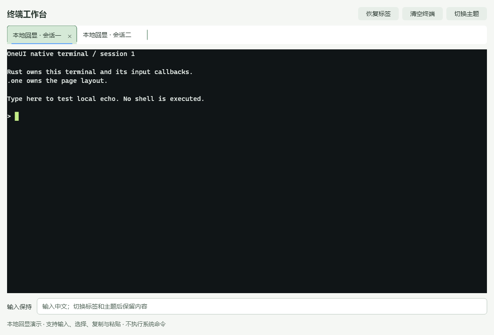
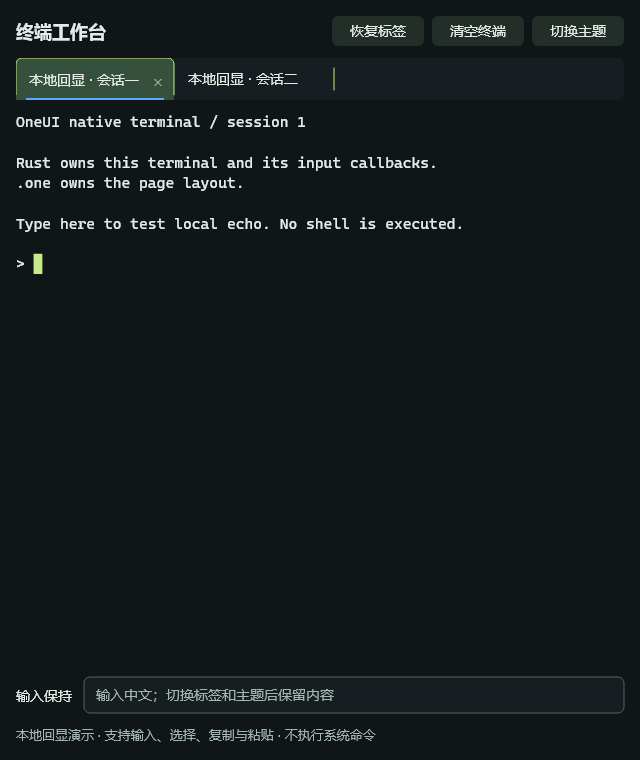

# NativeHost 与最小终端工作台

后续工作区已扩展连接侧栏、文件表格、图表和声明式 Tabs / SplitView，见[阶段56](56-declarative-terminal-workspace.md)。本页保留最小接入阶段的范围与验证记录。

2026-09-28。范围：补通声明式页面中的原生控件接入，验证 C++ 模板与 Rust 控件所有者协作。不是完整终端模拟器，也不是终端工作区清单所有 P0 项的完成声明。

## 最少需要写什么

先注册现有原生对象，再构建页面：

```cpp
#include <oneui/ui_compose.h>
#include <oneui/ui_theme.h>
#include <oneui/controls/terminal_view.h>

oneui::ui::Mount mount;
oneui::ui::applyTheme(mount); // 在构建前安装初始主题
const auto terminal = std::make_shared<oneui::TerminalView>();
mount.registerNative("terminal", terminal);
oneui::ui::Compose ui(mount);
auto page = ui.column({
    ui.row({ui.text(L"终端")}).align(L"center").wrap(false),
    ui.nativeHost("terminal").basis(0).grow()
});
```

相同的模板入口：

```xml
<template>
  <Column grow="1" wrap="false">
    <Row align="center" justify="space-between" wrap="false" basis="46" min="46" max="46" shrink="0">
      <Text>终端</Text>
    </Row>
    <NativeHost host="terminal" basis="0" grow="1" />
  </Column>
</template>
```

`host` 是静态注册名，不是 VM 表达式。注册名不存在、重复注册、内容为空、原生控件已经被其他容器挂载都会明确报错。不要同时把同一个控件交给旧布局 API；第一版只支持显式先卸载再挂载，不做隐式迁移。

`NativeHost` 是一个无装饰的原生 View，保留原来的控件身份。自然尺寸和测量委托给内容，最终区域交给内容；焦点、IME、鼠标和可访问性继续走原生树。应用不需要逐项计算位置。

## 所有权与线程

```cpp
mount.registerNative("terminal", nativeWidget, foreignOwner);
```

第三个参数是可选的 C++ `shared_ptr<void>` 所有者，仅存在于 C++ 一侧。注册项和实际 host 都持有它，因此 Mount 提前销毁而原生树仍然存在时，外部回调不会提前释放。host 析构先从控件树卸载内容，再释放所有者。控件完全卸载后可以再次挂载。

- 注册、挂载、主题变更和控件修改都在 UI 线程执行；这不是跨线程控件 API。
- `v-if` / `visible` 隐藏内容，保留原生对象；它们不是释放资源的 API。
- `ref` 得到的是 host 容器；原始内容仍由注册方持有。
- NativeHost 不解释内部控件的 CSS。外围主题由 Mount 管理；重型控件的专属样式由控件所有者/适配层显式设置。终端字体和 ANSI 配色不会随表单主题被重置。
- 后台任务使用既有 `UiMailbox::Sender` 或 Rust 的安全投递句柄。不能跨线程保存并调用原始窗口/控件指针。

## Rust 接入路径

[可运行示例](../examples/terminal_workbench/README.md)选择 **C++ 模板页面 + Rust 原生对象所有者 + 示例 v1 C ABI**。C++ 可执行程序负责窗口，Rust DLL 持有终端、输入框和回调。

1. Rust 的 `Widget::with_native_handle` 在明确的 unsafe 契约下借出 `OneUiWidget*`。借出的句柄不允许被 C++ 销毁，也不允许跨 UI 线程使用。
2. C++ `oneui::retainNativeWidget` 从这个有效句柄取得原生对象的共享持有；它是 C++ 适配函数，不是 C ABI。
3. C++ 创建一个调用 Rust destroy 函数的所有者，并将其传给 `registerNative`。C ABI 从不传 `shared_ptr`、Rust 引用、String 或 trait object。
4. 主题/标签变化使用同一控件树。销毁外部所有者时，Rust 包装器先注销回调；即使其他 C++ 引用暂时保留像素对象，也不再调用已经释放的 Rust 回调。

示例 ABI v1 的版本只属于 `bridge.h` 中的演示协议，不改变 SDK 全局 C ABI 版本。这里只打通显式命令与原生事件；尚未提供任意 Rust State 自动绑定 `.one`、生成 Rust 源码、通用自定义组件属性/事件注册。

## 本轮布局接口

`Row` / `Column` 支持：

| 属性 | 值 | 说明 |
|---|---|---|
| `align` | start / center / end / stretch | 交叉轴对齐；静态属性 |
| `justify` | start / center / end / space-between | 主轴分布；静态属性 |
| `wrap` | true / false，或 bool 状态绑定 | 显式换行开关 |

既有 Row 默认换行行为不变，Column 默认不换行；Content 的 `align` 仍表示限宽内容的水平位置。`basis/min/max` 继续约束父容器主轴，本轮没有把它们冒充通用 width/height，也没有加入 baseline、完整盒模型或图标属性。

## 验收

构建：Windows、MSVC Release、Rust MSVC、同一个 OneUI DLL，Yoga 布局。运行：

```powershell
.\examples\terminal_workbench\build.ps1 -Test
```

四组：GPU/软件 × 浅色宽窗口/深色640px窗口。每组覆盖：

- 真实 Rust TerminalView/TextField 的创建与 C++ 模板挂载；WM_CHAR 经过窗口路由进入 Rust 回调。
- 标签鼠标消息路由；两份独立内容；100 次切换、主题变更、关闭/恢复并执行布局绘制，控件身份、选区和订阅/样式条目数量保持稳定。
- 合成输入组合状态与焦点不被换肤打断；原生窗口从宽尺寸缩到640再恢复；42px 标签栏保持约束。
- 缺失注册、重复注册、同/跨 Mount 重复挂载；Mount 先销毁、host 延长实际 Rust 所有者寿命；Rust 所有者释放后回调已注销；原生对象可再挂载。
- 关闭后丢弃队列任务，后台投递返回失败；动画稳定后250ms观测区间内新增绘制帧为0（终端光标闪烁关闭）。
- 原有 declarative runtime 回归和模板/Compose 正反编译用例通过。

原生捕获：





机器可读结果及二进制哈希：[验证记录](benchmarks/terminal-workbench-20260928/result.json)。这不是性能基准，不据此给出 CPU/内存改善比例。

**未验收**：OS 中文输入法候选窗、物理键鼠自动化、跨显示器与多档物理 DPI、真实 PTY/SSH、动态业务标签增删和会话销毁策略、完整停靠/浮动控制器。默认示例的关闭标签是保留对象的隐藏策略；产品需要自己的真正会话关闭策略。
