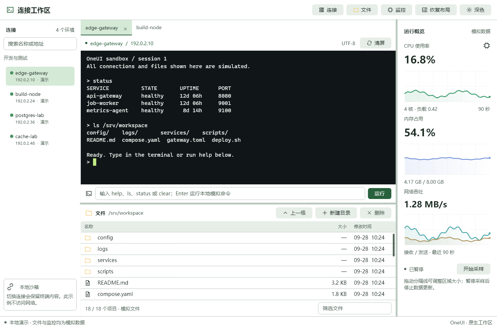
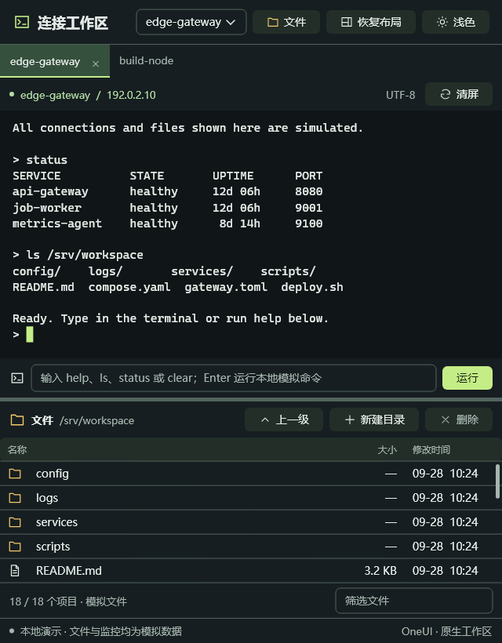

# 声明式终端工作区

2026-09-28。接续 NativeHost 最小接入，提供一个能够实际操作的完整页面，并把通用入口留在 SDK。它是本地模拟工作区，不是 iShellPro、SSH 客户端或完整终端模拟器。

## 运行与效果

```powershell
.\examples\terminal_workbench\build.ps1 -Test -Run
```





宽窗口使用连接侧栏、终端与文件分隔区、监控区；宽度低于1050逻辑像素时隐藏侧栏和监控区，通过顶部选择框切换连接。仍保留原对象及分隔比例；面板隐藏不销毁会话。文件表格使用已有原生虚拟化 Table。

## 可复用 SDK 入口

| 入口 | 状态与行为 |
|---|---|
| `Tabs` | `:items` 为 `State<vector<ui::TabItem>>`；每项 `{id,title}`；`v-model` 是 `State<wstring>` 业务 ID |
| `SplitView` | 恰好两个子元素；`orientation` horizontal / vertical；`v-model` 为 `State<float>`；`first-min` / `second-min` 为逻辑像素 |
| `TimeSeriesChart` | `:series` 为 `State<vector<TimeSeriesChartSeries>>`，原生绘制、保留控件身份 |
| `Icon`、`Button icon` | 共享命名图标；未知静态名称编译时报错 |
| `NativeHost themed="true"` | 显式让 TextField、Table、Tabs、VirtualList、TimeSeriesChart、SplitView 使用共享语义主题 |

示例：

```xml
<SplitView orientation="vertical" v-model="ratio" first-min="200" second-min="140">
  <Column>
    <Tabs :items="sessions" v-model="selected" closable="true" @close="closeSession" />
    <NativeHost host="terminal" grow="1" basis="0" />
  </Column>
  <TimeSeriesChart :series="cpuSeries" />
</SplitView>
```

`@close` 接收 `std::wstring` ID，ViewModel 对应成员是 `std::function<void(std::wstring)>`。关闭请求本身不删除数据；业务处理器决定移除哪一项、是否销毁会话。重复或空 ID 在修改原生标签前抛出错误。重排/改名按 ID 保留选择；选中项删除后选择第一项，空列表清空选择。

相同 C++ 入口：

```cpp
oneui::ui::Compose ui(mount);
auto page = ui.split(
    ui.column({
        ui.tabs(vm.sessions, vm.selected).closable(true).onClose(vm.closeSession),
        ui.nativeHost("terminal").basis(0).grow()
    }),
    ui.chart(vm.cpuSeries), vm.ratio
).orientation(L"vertical").firstMin(200).secondMin(140);
auto action = ui.button(L"文件", vm.openFiles).icon(L"folder");
```

比例0–1经过原生最小尺寸约束。鼠标拖动及分隔键盘操作回写状态；改变窗口尺寸只调整有效布局，不代表应用配置被保存。水平 Row 默认居中，需要填满交叉轴时显式 `align="stretch"`。

命名图标第一批：`terminal server folder file search plus close split layout cpu refresh sun copy pause up link download settings`。独立 Icon 可设 `size`（C++ `.size(24)`）与 CSS `color`。不是任意字符串字体图标接口。

`themed` 默认 false，保留旧 NativeHost 外观约定。主题使用已有 CSS 解析器和 `--surface / --ink / --muted / --line / --selection / --accent / --hover`；终端自身配色与字体不被重置。Tabs / SplitView 暂不接受任意浏览器 CSS；初始主题不启动尚无窗口推进的过渡，之后换肤保留原生动画。

## 验证

Windows / MSVC Release / Rust MSVC / Yoga，同一次构建产物。`check.ps1` 执行 GPU OpenGL 与软件渲染分别搭配浅色宽窗口、深色640px窗口，共四组。

- 原生 WM_CHAR、标签点击进入 Rust 回调；四个会话打开、关闭、恢复及输入保留。
- 100次切换、换肤、关闭/恢复；原生对象、输入选区、订阅数、样式条目数稳定。
- 连接搜索、文件筛选、新建/删除及选择；面板展开占满区域；通过原生鼠标消息拖动分隔线并验证比例回写。
- 图表状态更新不增加控件/订阅；实际后台线程经安全 mailbox 投递采样结果，暂停后停止更新。
- C++ Compose 标签重排保留业务ID、拒绝重复key；模板正反编译、源位置、插槽、scoped CSS及旧声明式运行回归。
- 深色 NativeHost 输入框初始颜色的绘制回归；保留文本和选区。VirtualList 标题测量与绘制统一使用配置字重，避免提前省略。
- 跨语言所有者寿命、重复挂载拒绝、关闭后后台投递被拒；稳定后250ms区间新增绘制帧为0（采样暂停，光标闪烁关闭）。

[四组日志与二进制哈希](benchmarks/terminal-workspace-20260928/result.json)。这属于功能与空闲重绘验证，不是 CPU/内存吞吐基准，不据此宣称性能提升百分比。

## 明确边界

连接、文件和资源曲线均为本地模拟。没有真实 SSH、PTY/ANSI 解析、文件传输、跨窗口停靠/浮动与布局持久化。Rust 控件接入继续采用示例 C ABI；没有生成 Rust 模板代码或任意 Rust State 自动映射。当前原生消息和合成 composition 测试不等于真实 OS 中文输入法候选窗、物理键鼠或跨显示器 DPI 验收。

之前最小接入的测试与截图保留在[阶段55](55-native-host-and-terminal-workbench.md)，本页是扩展后的工作区验收。

## 标签外观修正（同日）

修正基础 Tabs 文档模式中圆角边框、遮盖色块和焦点色下划线叠加的问题。现在选中态使用平整底色与主题色下划线；分隔线仅出现在相邻未选中项之间，不在最后一个标签后孤立出现。键盘焦点单独画在活动标签内部，颜色跟随共享主题。普通非文档 Tabs 的边框样式保留。

新增浅色/深色、两项/三项、不同选中位置和键盘焦点的绘制断言，配合四组原生工作区回归；这类错误不再仅靠人工观察发现。
