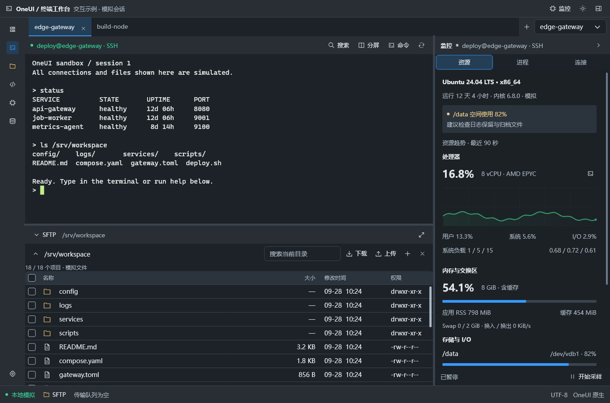
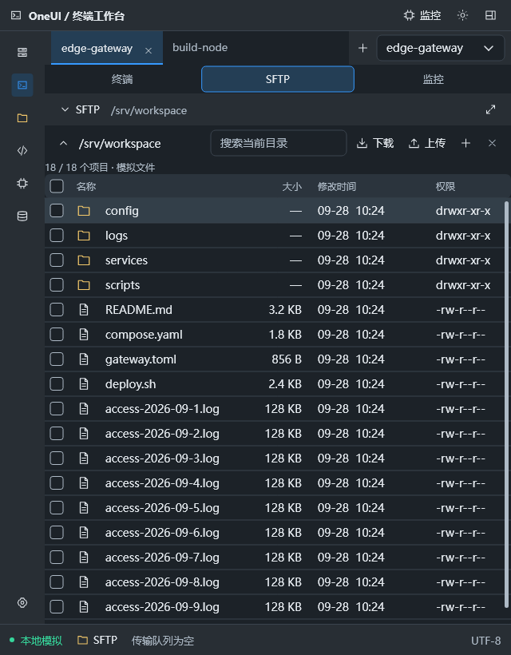

# 工作区快速布局：从网页原型到原生组件

本轮以终端工作区网页原型为布局参考，将重复的区域结构补到 OneUI SDK。示例位于 `examples/terminal_workbench`，仍由 `.one` + C++ ViewModel + Rust 原生终端组成，没有嵌入网页，也没有复制其他产品的业务实现。



## 先运行

```powershell
# 仓库根目录；需要 VS C++、已构建的 Skia、Rust MSVC 工具链
.\examples\terminal_workbench\build.ps1 -Test
.\examples\terminal_workbench\build-current\bin\oneui-terminal-workbench.exe --dark
# 窄窗口，直接打开文件区域
.\examples\terminal_workbench\build-current\bin\oneui-terminal-workbench.exe --dark --narrow --scene files
```

## 写区域，不算坐标

`Workspace` 按区域职责生成原生 Yoga 布局。正文必填，其他区域可省略；重复区域和错误的直接子组件会在 `.one` 编译时报源位置错误。C++ 组合入口也校验结构。

```xml
<Workspace>
  <TitleBar><Text text="我的工作区" /><Spacer /></TitleBar>
  <NavigationRail>
    <ToolButton icon="folder" name="打开文件" @click="openFiles" />
  </NavigationRail>
  <SessionBar><Tabs :items="sessions" v-model="selected" /></SessionBar>
  <WorkspaceBody>
    <DockPanel>
      <PanelHeader><Text text="文件" /><Spacer /></PanelHeader>
      <PanelBody><NativeHost host="files" themed="true" /></PanelBody>
      <PanelFooter><Text :text="summary" /></PanelFooter>
    </DockPanel>
  </WorkspaceBody>
  <StatusBar><Text text="就绪" /></StatusBar>
</Workspace>
```

C++ 对应 `Compose::workspace/titleBar/navigationRail/sessionBar/workspaceBody/statusBar`、`dockPanel/panelHeader/panelBody/panelFooter`。两种入口共用组件适配层，不维护两套控件。

| 组件 | 默认行为 |
|---|---|
| `Workspace` | 标题栏在顶部，导航在左侧，会话栏在正文上方，状态栏在底部 |
| `NavigationRail` | 56px 固定宽度，纵向排列图标按钮 |
| `TitleBar / SessionBar / StatusBar` | 默认高度 38 / 42 / 38px；TitleBar 是内容区域，不代替操作系统标题栏 |
| `DockPanel` | 必须有一个 PanelHeader 和一个 PanelBody，可有一个 PanelFooter；自动按职责排序 |
| `PanelHeader / PanelFooter` | 默认 40px 高；正文取得剩余空间 |
| `Spacer` | 填充剩余空间，将后续操作推向另一端 |
| `ToolButton` | 原生按钮，默认透明外观与图标；`name` 同时提供可访问名称和提示 |
| `Progress` | 原生进度条，`:value` 绑定 `State<float>`，值域 0–1 |
| `Tabs presentation="segmented"` | 等宽分段切换；普通会话标签默认 document 外观 |

这些是布局默认值，可通过已有 class、布局属性和 CSS 调整。`.one` 仍是 C++ 原生模板，不支持浏览器的全部 CSS。

## 收起时保留对象和分隔比例

```xml
<SplitView orientation="vertical" v-model="ratio"
           :second-collapsed="collapsed" collapsed-extent="40">
  <NativeHost host="terminal" />
  <DockPanel :collapsed="collapsed">
    <PanelHeader>
      <ToolButton icon="down" name="展开或收起" @click="toggle" />
      <Text text="文件" />
    </PanelHeader>
    <PanelBody><NativeHost host="files" themed="true" /></PanelBody>
  </DockPanel>
</SplitView>
```

同一个 `State<bool>` 控制两件事：SplitView 给第二块只留标题高度；DockPanel 隐藏自己的正文和页脚。它们保留控件、输入内容与原分隔比例，展开时恢复。不要再对同一正文单独绑定相互冲突的 `visible`。本功能即时切换，不宣称有展开动画。`DockPanel` 名称指面板组织，不表示已支持任意拖拽停靠或浮动窗口。

## 主题与窄窗口

`workspaceTheme(dark)` 提供可选的蓝色强调、灰蓝表面的紧凑工作区外观。现有默认绿色主题保持兼容。原生表格、标签、按钮和进度条跟随同一套语义颜色。

示例在宽度小于 1050px 时，用“终端 / 文件 / 监控”分段切换主区域。策略由 ViewModel 决定，尺寸分配由 SDK 完成；应用不调用子控件 `setFrame`。窗口恢复后原有终端、分屏对象和输入内容保留。这个断点不是 SDK 对所有应用强制规定。



## 这版可以体验什么

- 窄导航栏、会话标签、终端＋文件＋监控组合；分隔线支持鼠标和键盘调整。
- 四个模拟会话，每个保留独立的第二终端；关闭再打开标签、切换主题或区域不会创建新终端。
- 当前终端可见网格的文本搜索、命令输入栏、清空、分屏。
- 模拟文件表格：多选、筛选后按文件名保留仍可见选择、目录进入／返回、添加和删除；上传插入内存数据，下载显示模拟进度。
- 监控资源、进程、连接三个区域，图表和进度条；开始／暂停模拟采样。
- F12 打开 SDK 内置诊断，Ctrl+F12 导出报告。

仍不包含真实 SSH、PTY、SFTP、远程进程控制、AI、完整拖拽停靠和会话持久化。终端搜索仅查当前可见网格，不是完整 scrollback 搜索。它是布局和原生控件互操作示例，不是终端产品交付。

## 验证与证据

- `declarative_runtime`、`declarative_compiler`：共享组件结构、C++ 与模板属性、非法区域与重复区域诊断、收起恢复、主题和窗口尺寸变化、对象及订阅数保持。
- 原生四组：GPU／软件 × 浅色宽屏／深色窄屏；原生鼠标和 WM_CHAR 输入、100 次标签／主题／关闭恢复循环、分屏内容保留、搜索、文件选择、窗口缩放、异步关闭与空闲重绘为 0。
- 原生截图检查深色宽屏、分屏、收起、进程和 640px 文件区；组件运行测试额外检查 640／1360 宽度。
- 记录存于 [本轮验证目录](benchmarks/terminal-workspace-v4-20260928/README.md)。这不是新的 CPU／内存对比基准；不将功能回归冒充性能提升数据。真实中文 IME 候选窗和跨显示器 DPI 仍未在本轮验收。

本页覆盖 [上一阶段](56-declarative-terminal-workspace.md) 的页面布局与体验说明；跨语言所有权仍见 [NativeHost 契约](55-native-host-and-terminal-workbench.md)。
